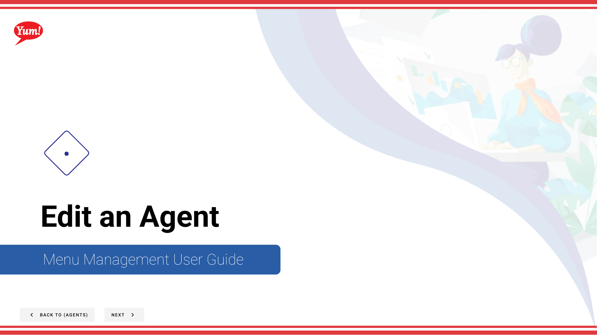
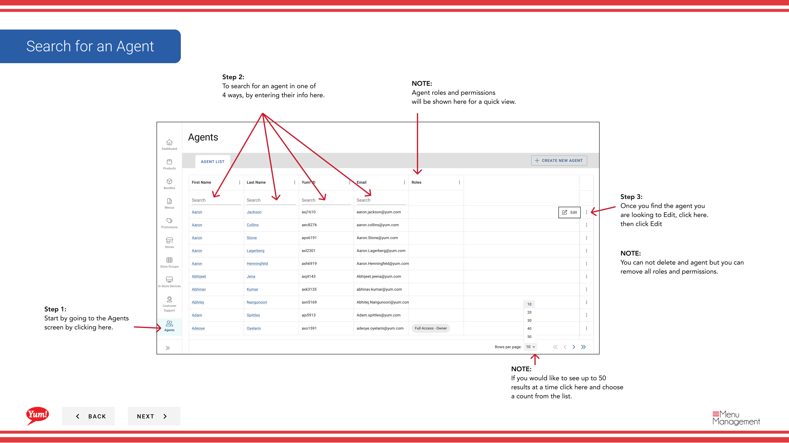

# Edit an Agent

## What this guide covers

Updates an existing agent's account details, roles, or access permissions.

## Steps

**Step 1:** Start by going to the Agents screen by clicking here.

**Step 2:** To search for an agent in one of 
4 ways, by entering their info here.

**Step 3:** Once you find the agent you are looking to Edit, click here. then click Edit

**Step 4:** To edit any information you click
one of the two blue links or Next.

**Step 5:** When you have completed all
of your changes in any of the steps
you can click Save.

**Step 6:** After saving your changes click
quit to exit the edit screens.

## Notes

:::note
Agent roles and permissions
will be shown here for a quick view.
:::

:::note
You can not delete and agent but you can
remove all roles and permissions.
:::

:::note
If you would like to see up to 50
results at a time click here and choose
a count from the list.
:::

:::note
If you need to stop your edits click here.
Please be aware that your info will not be saved.
:::

:::note
If you need to stop your edits click here.
Please be aware that your info will not be saved.
:::

:::note
If you need to go back and change
something on the previous screen, 
click Back.
:::

## Additional information

- Menu Management User Guide
- Edit the Agents’ info

---

*Part of the [Admin Portal Guide](/docs/admin-portal-guide) · Section: Agents*