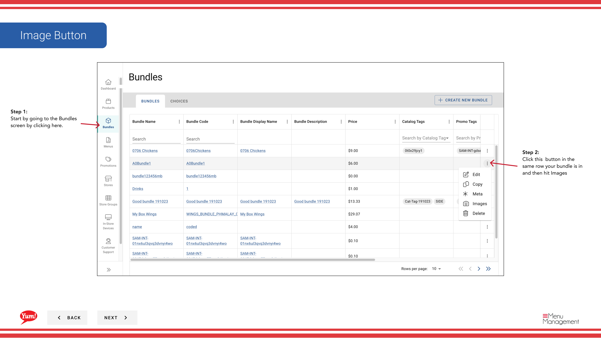

# Add an Image to a Bundle

## What this guide covers

Uploads or links a display image to a bundle so customers see the correct combo visual when ordering on online channels.

## Steps

**Step 1:** Navigate to the **Bundles** section using the left-hand navigation menu.

**Step 2:** Find the bundle you want to add an image to by searching by Bundle Name, Bundle Code, Catalog Tags, or Promo Tags.

**Step 3:** Click the **⋮** (three-dot menu) button in the same row as the bundle, then select **Images**.

**Step 4:** A drawer opens with image fields. Fill in the following information:

| Field | What to enter | Notes |
|-------|--------------|-------|
| **Image URL** | Full URL to the image file | e.g., `https://cdn.example.com/bundle-3pc.jpg`. The image should be in a standard format (JPG, PNG). |
| **Image Label** | Name or title for the image | e.g., "3-Piece Meal" or "Main Product Image" |
| **Alt Text** | Description of what the image shows | Used for accessibility and displays if the image cannot load |
| **Primary Image** | Yes or No | Toggle to "Yes" to set this as the main image displayed on ordering channels |

**Step 5:** Click **Save** to attach the image to the bundle.

:::tip
You can add multiple images to a bundle. Set one as the **Primary Image** (Yes) so customers see the best representation on ordering platforms.
:::

## Related guides

- [Create a Bundle](/docs/admin-portal-guide/bundles/create-a-bundle/)
- [Edit a Bundle](/docs/admin-portal-guide/bundles/edit-a-bundle/)

---

*Part of the [Admin Portal Guide](/docs/admin-portal-guide) · Section: Bundles*