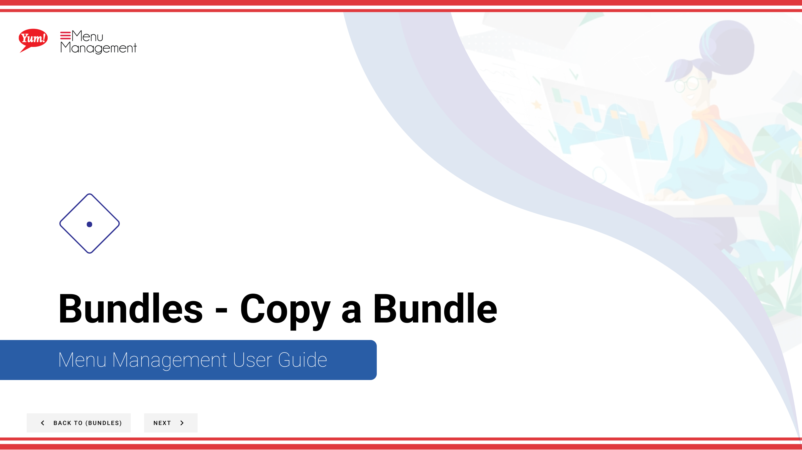
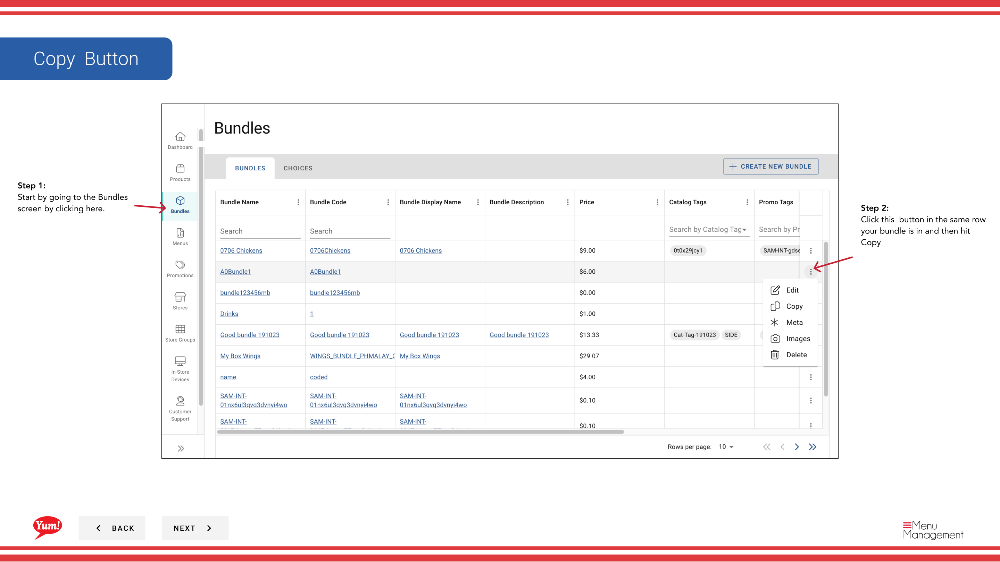

# Copy a Bundle

## What this guide covers

Duplicates a bundle to accelerate setup of similar combo offerings.

## Steps

**Step 1:** Start by going to the Bundles screen by clicking here.

**Step 2:** Click this  button in the same row your bundle is in and then hit Copy

**Step 2:** You’ll need to create a Bundle Code

## Additional information

- Bundles - Copy a Bundle
- (Optional):  Revise if necessary by default the bundle name will be titled copy of whatever bundle you copied.
- (Optional):  Since you copied a bundle the bundle choices for this new bundle will be the same as the one you copied. Revise or edit if necessary. The flow will be the same as creation.

---

*Part of the [Admin Portal Guide](/docs/admin-portal-guide) · Section: Bundles*