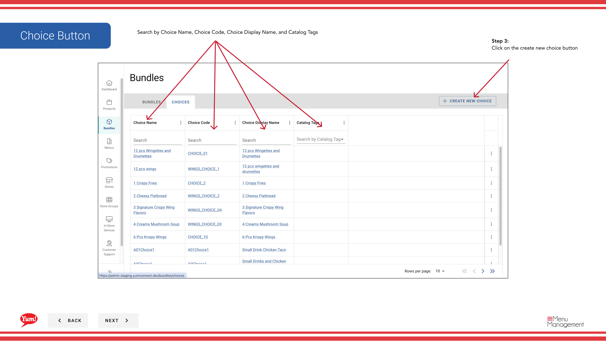
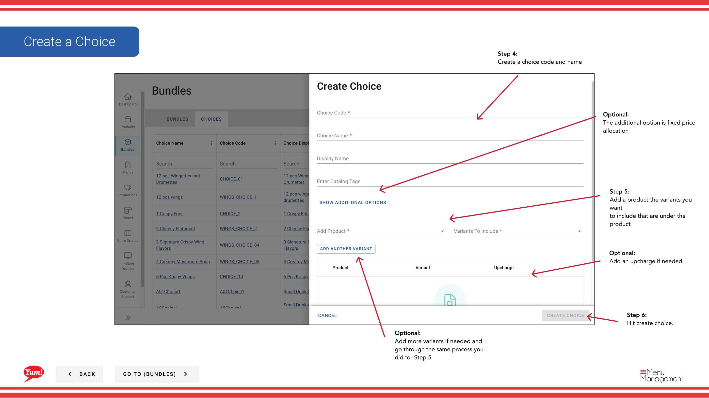

# Create a Choice

## What this guide covers

Adds a selectable item within a bundle (e.g. 'Choose your drink'), giving customers the ability to personalise their combo.

## Steps

**Step 1:** Start by going to the Bundles screen by clicking here.

**Step 2:** Click on the choices tab

**Step 3:** Click on the create new choice button

**Step 4:** Create a choice code and name

**Step 5:** Add a product the variants you want to include that are under the product

**Step 6:** Hit create choice.

## Additional information

- Bundles - Create a Choice
- Search by Bundle Name, Bundle Code, Catalog Tags, Promo Tags
- Search by Choice Name, Choice Code, Choice Display Name, and Catalog Tags
- Optional: Add more variants if needed and go through the same process you did for Step 5

---

*Part of the [Admin Portal Guide](/docs/admin-portal-guide) · Section: Bundles*