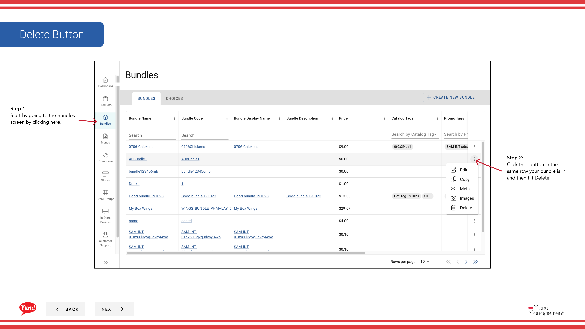

# Delete a Bundle

## What this guide covers

Permanently removes a bundle from the catalogue and all menus where it is assigned.

## Steps

**Step 1:** Navigate to the **Bundles** section using the left-hand navigation menu.

**Step 2:** Find the bundle you want to delete by searching by Bundle Name, Bundle Code, Catalog Tags, or Promo Tags.

**Step 3:** Click the **⋮** (three-dot menu) button in the same row as the bundle, then select **Delete**.

**Step 4:** A confirmation modal appears asking you to confirm the deletion. Click **Confirm** to delete the bundle, or click outside the modal or **Cancel** to keep it.

:::caution
This action is permanent. Deleting a bundle will automatically remove it from all menus and categories where it is assigned. You cannot undo this action.
:::

## Related guides

- [Create a Bundle](/docs/admin-portal-guide/bundles/create-a-bundle/)
- [Edit a Bundle](/docs/admin-portal-guide/bundles/edit-a-bundle/)

---

*Part of the [Admin Portal Guide](/docs/admin-portal-guide) · Section: Bundles*