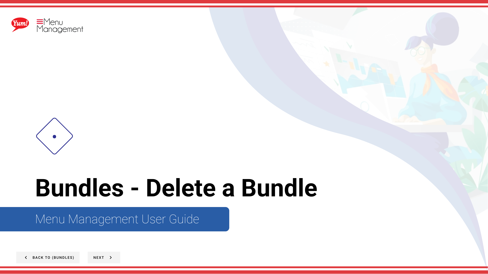

# Delete a Bundle

## What this guide covers

Permanently removes a bundle from the catalogue.

## Steps

**Step 1:** Start by going to the Bundles screen by clicking here.

**Step 2:** Click this  button in the same row your bundle is in and then hit Delete

**Step 3:** Click to delete

## Notes

:::note
Cancel at anytime if necessary
:::

:::note
Keep in my mind that deleting the bundle you selected will automatically take of any menu or category it is in.
:::

## Additional information

- Bundles - Delete a Bundle

---

*Part of the [Admin Portal Guide](/docs/admin-portal-guide) · Section: Bundles*