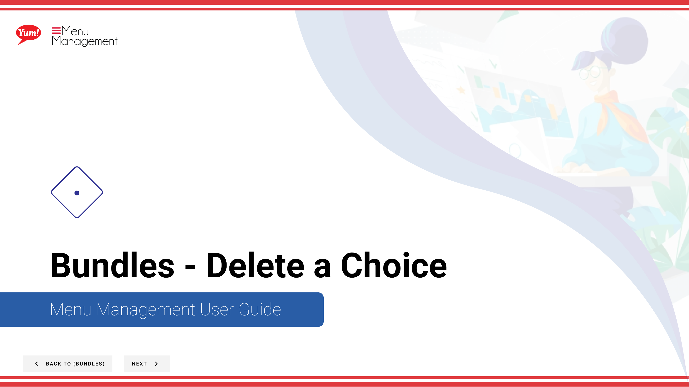

# Delete a Choice

## What this guide covers

Removes a choice from a bundle when no longer needed.

## Steps

**Step 1:** Start by going to the Bundles screen by clicking here.

**Step 2:** Click on the choices tab

**Step 3:** Click this  button in the same row the choice you want to delete is in and then click delete

**Step 4:** Click to delete

## Notes

:::note
Keep in my mind that deleting this choice will remove all choice values and corresponding variants and pricing from related products.
:::

:::note
Cancel at anytime if necessary
:::

## Additional information

- Bundles - Delete a Choice
- Search by Bundle Name, Bundle Code, Catalog Tags, Promo Tags

---

*Part of the [Admin Portal Guide](/docs/admin-portal-guide) · Section: Bundles*