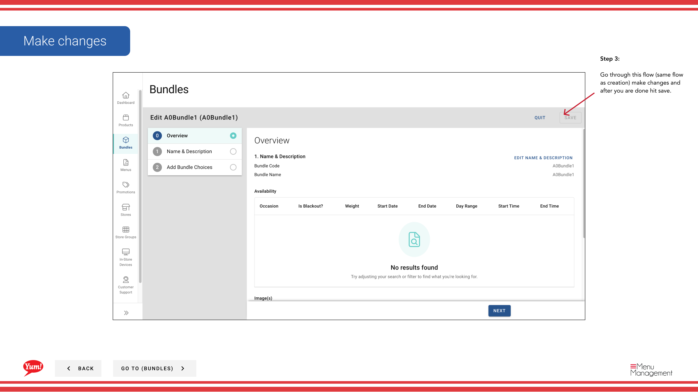

# Edit a Bundle

## What this guide covers

Updates an existing bundle's details such as name, pricing, or description.

## Steps

**Step 1:** Start by going to the Bundles screen by clicking here.
**Step 2:** Click this  button in the same row your bundle is in and then hit Edit

**Step 3:** Go through this flow (same flow as creation) make changes and after you are done hit save.

## Additional information

- Bundles - Edit a Bundle
- Search by Bundle Name, Bundle Code, Catalog Tags, Promo Tags

---

*Part of the [Admin Portal Guide](/docs/admin-portal-guide) · Section: Bundles*