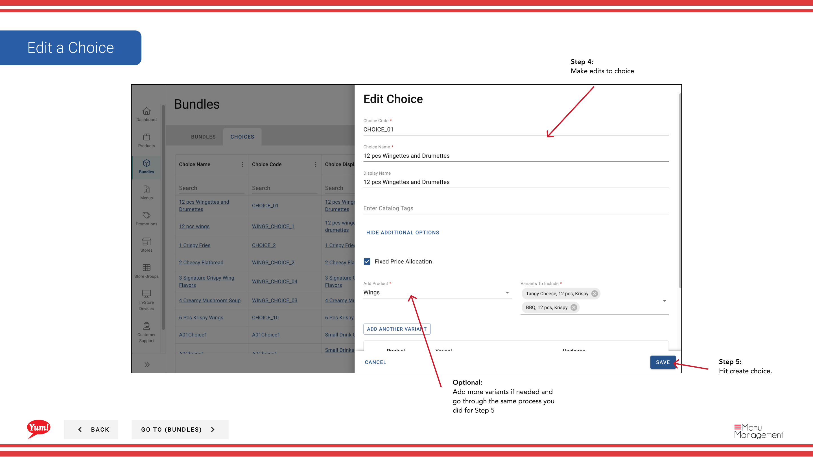

# Edit a Choice

## What this guide covers

Updates an existing choice's name, products, variants, or min/max quantity settings.

## Steps

**Step 1:** Navigate to the **Bundles** section using the left-hand navigation menu.

**Step 2:** Click the **Choices** tab at the top of the Bundles screen.

**Step 3:** Find the choice you want to edit. You can search by Choice Name, Choice Code, Choice Display Name, or Catalog Tags.

**Step 4:** Click the **⋮** (three-dot menu) button in the same row as the choice, then select **Edit**.

**Step 5:** Update any of the following fields:
- **Choice Name** or **Choice Display Name**
- **Min Quantity** or **Max Quantity**
- **Products**: Add or remove products and their variants

**Step 6:** Click **Save** to commit your changes.

:::tip
You can add or remove products and variants at any time without affecting bundles that use this choice.
:::

## Related guides

- [Create a Choice](/docs/admin-portal-guide/bundles/create-a-choice/)
- [Copy a Choice](/docs/admin-portal-guide/bundles/copy-a-choice/)
- [Delete a Choice](/docs/admin-portal-guide/bundles/delete-a-choice/)

---

*Part of the [Admin Portal Guide](/docs/admin-portal-guide) · Section: Bundles*