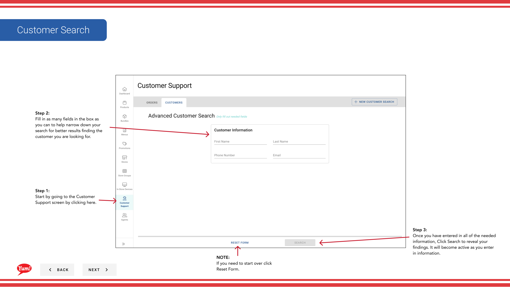
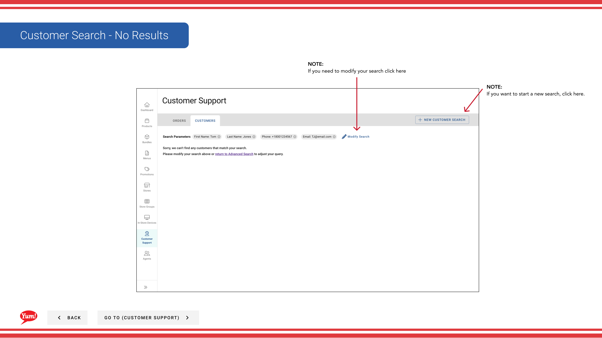

# Customer Search

## What this guide covers

Looks up a customer account by name, email, or phone number to view their order history and profile — used by support teams to assist customers with account-related queries.

## Steps

**Step 1:** Start by going to the Customer Support screen by clicking here.
**Step 2:** Fill in as many fields in the box as you can to help narrow down your search for better results finding the customer you are looking for.

**Step 3:** Once you have entered in all of the needed information, Click Search to reveal your findings. It will become active as you enter in information.

**Step 4:** Once you have found the customer, click on the 3 vertical dots and click on Reset.

**Step 5:** A modal will appear, click here to send a link to the customer to allow them to reset their password.

## Notes

:::note
If you need to start over click Reset Form.
:::

:::note
If you need to modify your search click here
:::

:::note
To cancel just click here.
:::

:::note
If you want to start a new search, click here.
:::

## Additional information

- Customer Support: Customer Search
- Customer Search - No Results

---

*Part of the [Admin Portal Guide](/docs/admin-portal-guide) · Section: Customer Support*