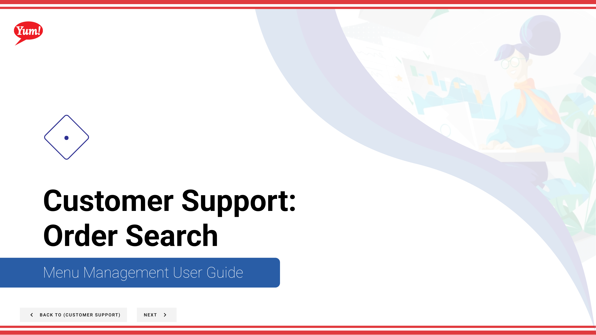
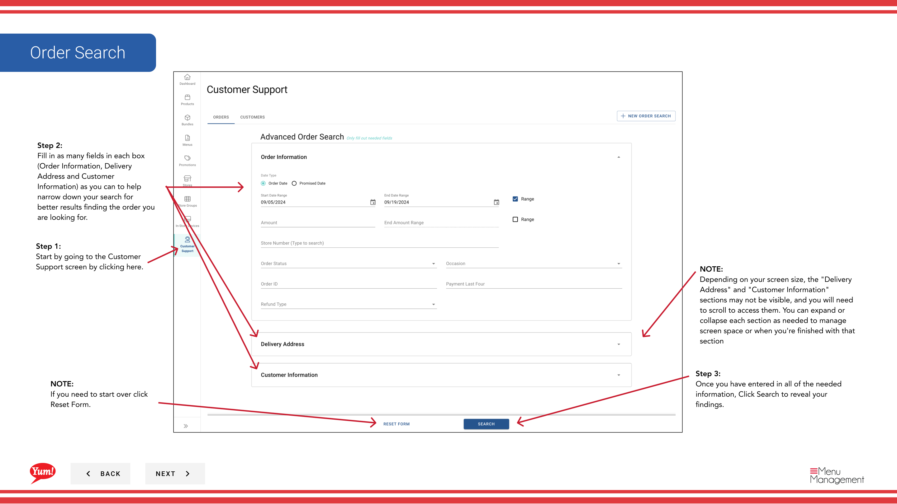
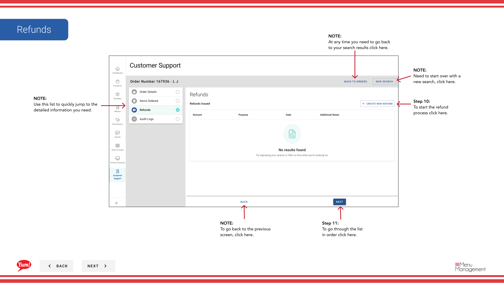
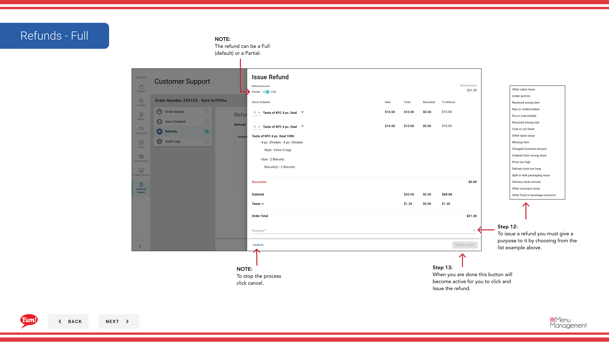
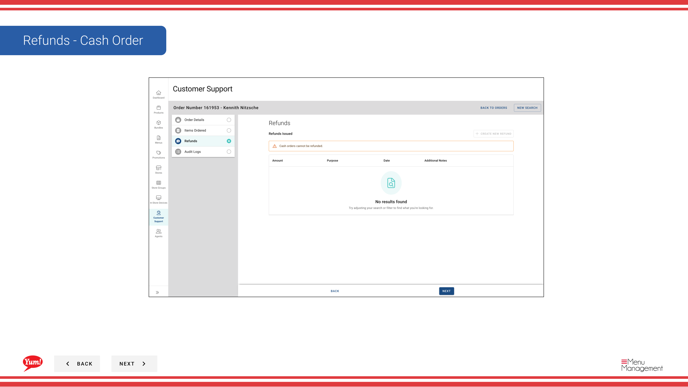
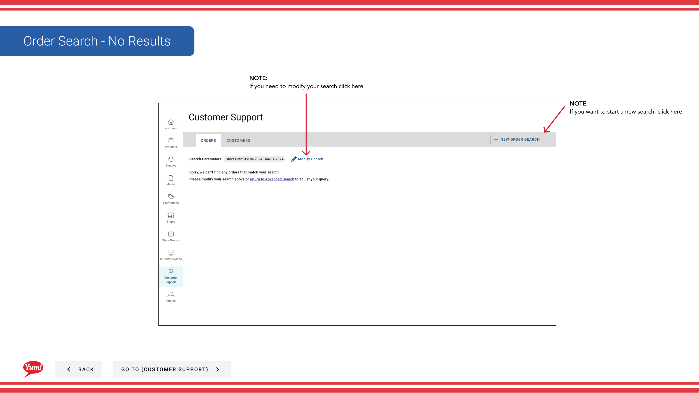
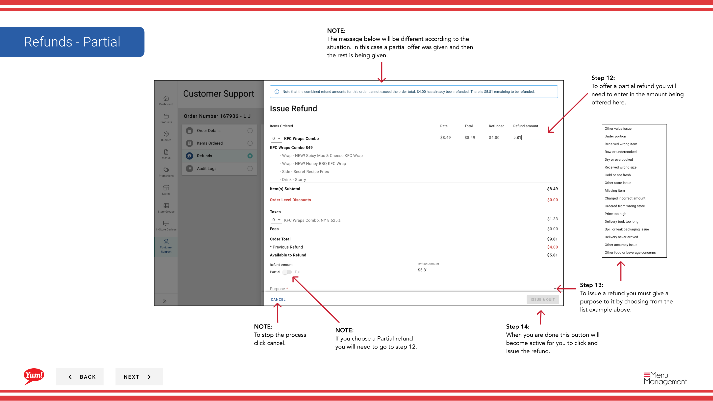

# Order Search

## What this guide covers

Searches for a specific customer order in Atlas using filters such as order ID, date, or store — the primary tool for support agents investigating order issues, issuing refunds, or verifying order status.

## Steps

**Step 1:** Start by going to the Customer Support screen by clicking here.

**Step 2:** Fill in as many fields in each box (Order Information, Delivery Address and Customer Information) as you can to help narrow down your search for better results finding the order you are looking for.

**Step 3:** Once you have entered in all of the needed information, Click Search to reveal your findings.

**Step 4:** Once your search results appear, you will see several columns of information. You man need to scroll left to see more.

**Step 5a:** To see more detailed information click the order number.

**Step 5b:** To find the exact info you are looking for choose from this list by clicking on the 3 vertical dots.

**Step 6:** To go through the list in order click here.

**Step 7:** To resend the customers receipt click here to open a drawer to verify their email address.

**Step 8:** To send the receipt click here.

**Step 9:** To go through the list in order click here.

**Step 10:** To start the refund process click here.

**Step 11:** To go through the list in order click here.

**Step 12:** To issue a refund you must give a purpose to it by choosing from the list example above.

**Step 12:** To offer a partial refund you will need to enter in the amount being offered here.

**Step 13:** When you are done this button will become active for you to click and Issue the refund.

**Step 13:** To issue a refund you must give a purpose to it by choosing from the list example above.

**Step 14:** When you are done this button will become active for you to click and Issue the refund.

## Notes

:::note
Depending on your screen size, the "Delivery Address" and "Customer Information" sections may not be visible, and you will need to scroll to access them. You can expand or collapse each section as needed to manage screen space or when you're finished with that section
:::

:::note
If you need to start over click Reset Form.
:::

:::note
Depending on your screen size you may need to scroll to the left to see the more columns.
:::

:::note
If you need to modify your search criteria click here
:::

:::note
If you would like to see up to 50 results at a time click here and choose a count from the list.
:::

:::note
Need to start over with a new search, click here.
:::

:::note
Use this list to quickly jump to the detailed information you need.
:::

:::note
At any time you need to go back to your search results click here.
:::

:::note
To go back to the previous screen, click here.
:::

:::note
If you do not want to send the receipt, click here.
:::

:::note
You can choose an alternate email address to send the receipt to
:::

:::note
To stop the process click cancel.
:::

:::note
The refund can be a Full (default) or a Partial.
:::

:::note
If you choose a Partial refund you will need to go to step 12.
:::

:::note
If you need to modify your search click here
:::

:::note
If you want to start a new search, click here.
:::

## Additional information

- Customer Support: Order Search
- Order Search - No Results

---

*Part of the [Admin Portal Guide](/docs/admin-portal-guide) · Section: Customer Support*