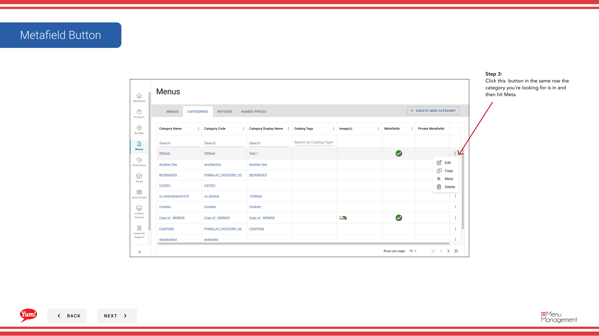

# Add Metafields to a Category

## What this guide covers

Attaches custom data to a category for integration or market-specific display requirements.

## Steps

**Step 1:** Start by going to the Menu screen by clicking here.
**Step 2:** Click on the categories folder

**Step 3:** Click this  button in the same row the category you’re looking for is in and then hit Meta

**Step 4:** Click this button to add category metafield content it will open up this drawer in the image below

**Step 5:** After you finish filling out this content and press add category metafields the public metafield will be added to the category.

**Step 6:** Click this button to add category metafield content it will open up this drawer in the image below

**Step 7:** After you finish filling out this content and press add category metafields the private metafield will be added to the category.

## Additional information

- Menus - Add Category Metafields
- Adding Public Metafields

---

*Part of the [Admin Portal Guide](/docs/admin-portal-guide) · Section: Menus*