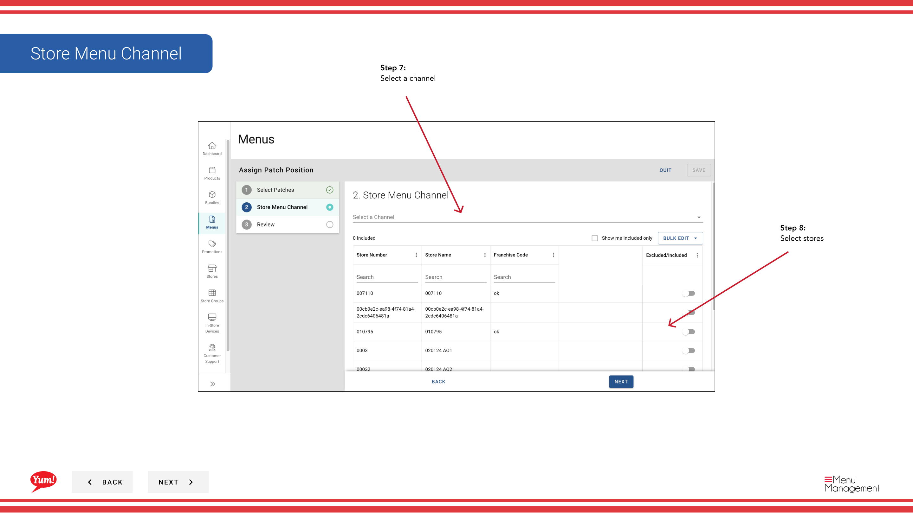
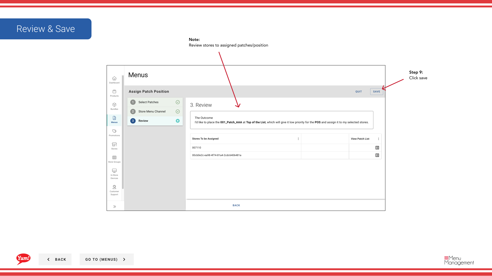

# Assign a Patch (Add to Patch List)

## What this guide covers

Adds a patch to a store's active patch list, layering its overrides on top of the base menu.

## Steps

**Step 1:** Start by going to the Menu screen by clicking here.

**Step 2:** Click on the patches tab

**Step 3:** Click create new paatch

**Step 4:** Select add patch to list

**Step 5:** Select patch

**Step 6:** Choose patch position

**Step 7:** Select a channel

**Step 8:** Select stores

**Step 9:** Click save

## Notes

:::note
Review stores to assigned patches/position
:::

## Additional information

- Menus - Assign a Patch  (Add to Patch List)
- Assign Patch Button Group

---

*Part of the [Admin Portal Guide](/docs/admin-portal-guide) · Section: Menus*