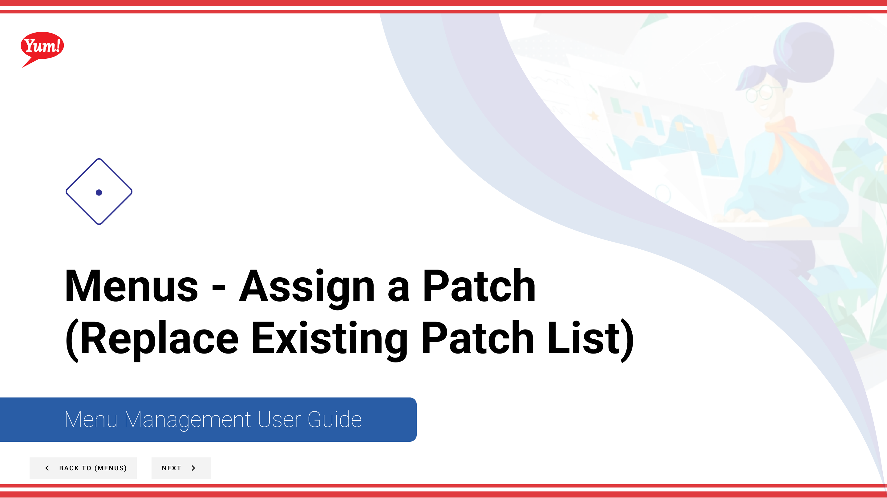

# Assign a Patch (Replace Existing List)

## What this guide covers

Replaces a store's current patch list with a new one, used when a full patch reset is needed.

## Steps

**Step 1:** Start by going to the Menu screen by clicking here.

**Step 2:** Click on the patches tab

**Step 3:** Click create new paatch

**Step 4:** Click the flow that best applies to what you want to do

**Step 5:** Select patch by name

**Step 6:** Select stores

**Step 7:** Select the menu channel

**Step 8:** Hit save

## Notes

:::note
You can search stores by specific store group as well by clicking this dropdown and selecting a store group.
:::

:::note
Here you can review every thing before save
:::

## Additional information

- Menus - Assign a Patch  (Replace Existing Patch List)
- Assign Patch Button Group

---

*Part of the [Admin Portal Guide](/docs/admin-portal-guide) · Section: Menus*