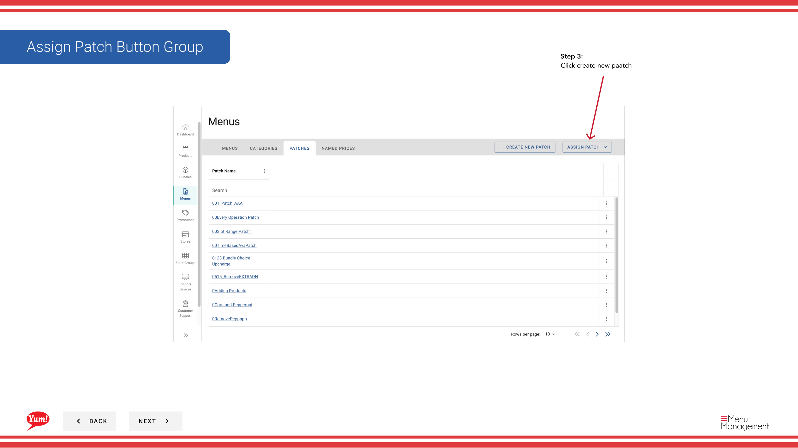
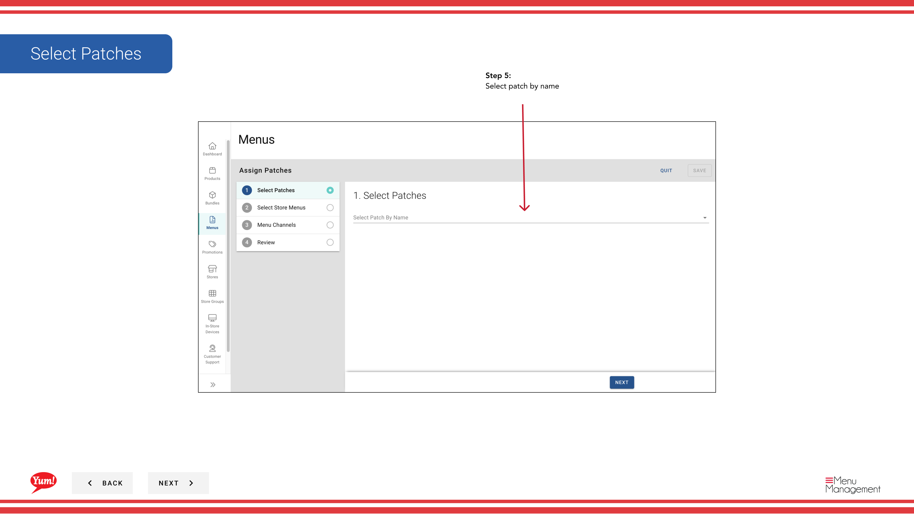
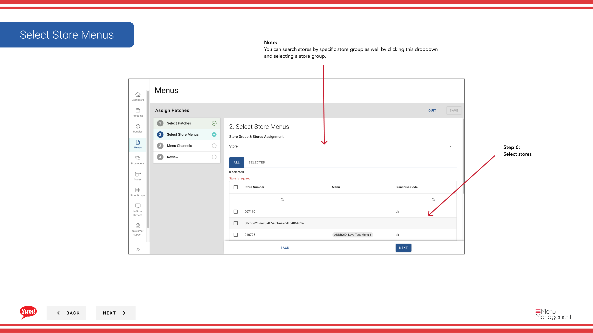
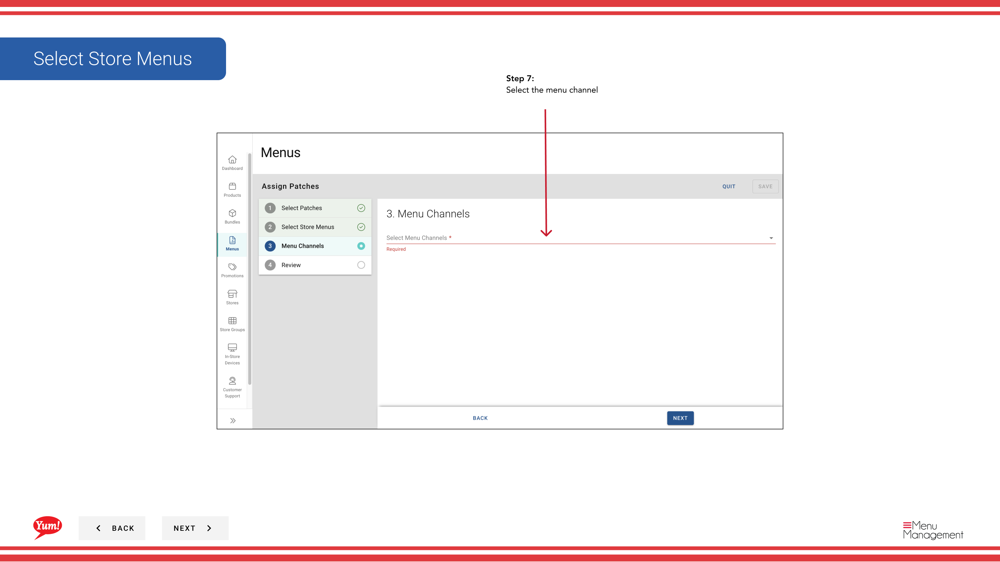

# Assign a Patch (Replace Existing List)

## What this guide covers

Replaces a store's entire patch list with a new single patch, removing any previously assigned patches. Use this when you need a full reset of patches for a store or channel.

## Steps

**Step 1:** Navigate to the **Menus** section using the left-hand navigation menu.

**Step 2:** Click on the **Patches** tab to view all patches.

**Step 3:** Click the **Create New** button to begin a new patch assignment.

**Step 4:** Select **Replace Existing List** to replace the store's patch list entirely.

**Step 5:** Select the **Patch** you want to assign from the dropdown. This patch will replace all currently assigned patches.

| Field | What to enter | Notes |
|-------|--------------|-------|
| **Patch** * | Select from the list of available patches | Choose the patch that will be the only patch on the selected stores. All previous patches will be removed. |

**Step 6:** Select the **Stores** that will receive this new patch list. You can search by store name or select by store group using the dropdown filter.

| Field | What to enter | Notes |
|-------|--------------|-------|
| **Stores** * | Select one or more stores | Use search to find stores, or click the dropdown to select entire store groups. Only selected stores will have their patch list replaced. |

**Step 7:** Select the **Channel** where this patch replacement applies.

| Field | What to enter | Notes |
|-------|--------------|-------|
| **Channel** * | Select the ordering channel | e.g., "Web", "Mobile", "Delivery Platform". The patch will only be assigned on the selected channel. |

**Step 8:** Review your selections on the **Summary** page to confirm the stores and patch, then click **Save** to replace the patch lists.

:::caution
Replacing a patch list will remove all previously assigned patches from the selected stores on this channel. Any overrides from the old patches will no longer apply. This action cannot be undone — if you need the old patches back, you must reassign them manually.
:::

## Related guides

- [Assign a Patch (Add to Patch List)](/docs/admin-portal-guide/menus/assign-a-patch-add-to-patch-list/) — Add a patch without removing existing ones
- [Edit a Patch](/docs/admin-portal-guide/menus/edit-a-patch/) — Update a patch before assigning it
- [Create a Patch](/docs/admin-portal-guide/menus/create-a-patch/) — Create a new patch to assign

---

*Part of the [Admin Portal Guide](/docs/admin-portal-guide) · Section: Menus*