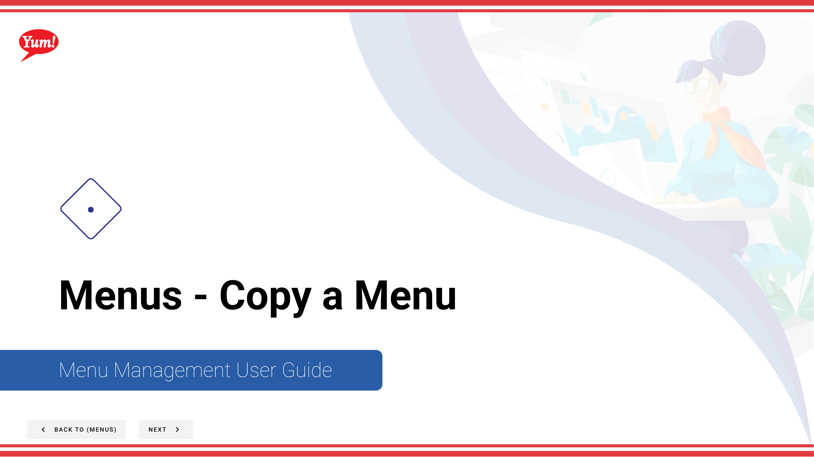
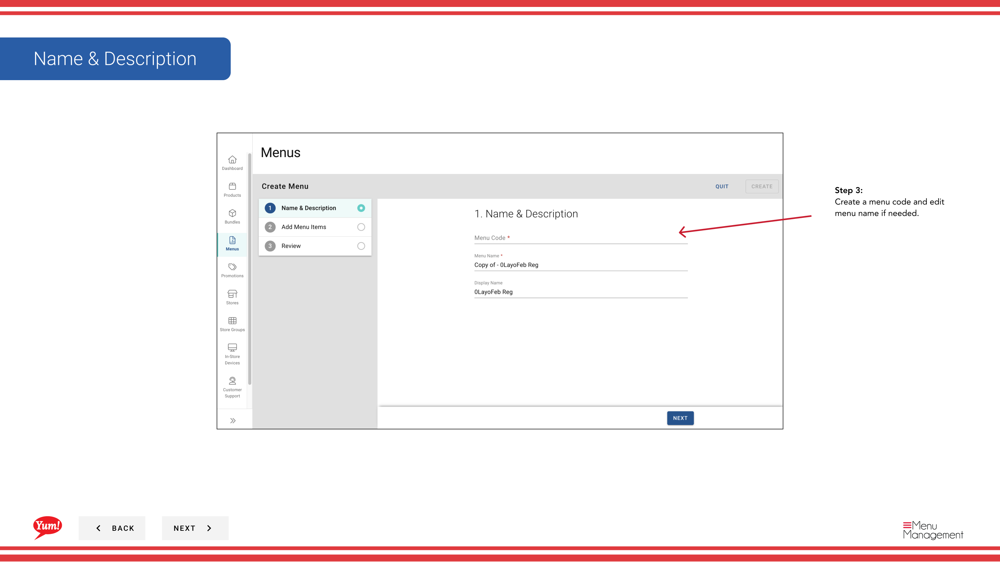

# Copy a Menu

## What this guide covers

Duplicates a menu to use as a starting point for a new menu, saving significant setup time.

## Steps

**Step 1:** Start by going to the Menu screen by clicking here.

**Step 2:** Click this button in the same row the menu you’re looking for is in and then hit Copy

**Step 3:** Create a menu code and edit menu name if needed.

**Step 3:** Click create when done.

## Notes

:::note
Make changes here if necessary
:::

---

*Part of the [Admin Portal Guide](/docs/admin-portal-guide) · Section: Menus*