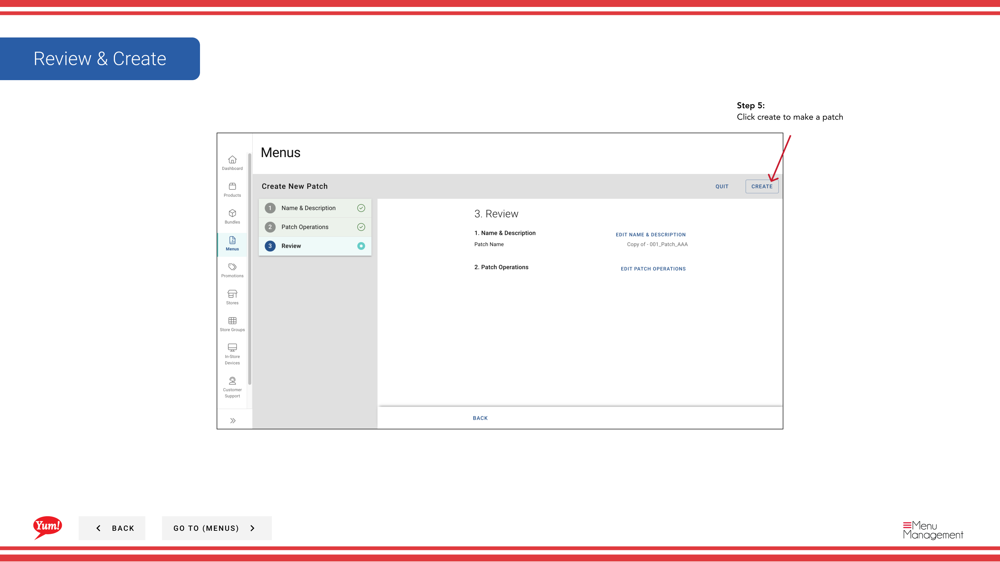

# Copy a Patch

## What this guide covers

Duplicates an existing patch to use as a starting point for a similar set of overrides.

## Steps

**Step 1:** Navigate to the **Menus** section using the left-hand navigation menu.

**Step 2:** Click on the **Patches** tab to view all patches.

**Step 3:** Find the patch you want to copy, click the **action menu** (three dots) in the same row, and select **Copy**.

**Step 4:** Update the patch name. By default, the system will name it “copy of [original patch name]”.

| Field | What to enter | Notes |
|-------|--------------|-------|
| **Patch Name** | A descriptive name for this new patch | e.g., “Sydney Q2 Pricing Override” (copied from “Sydney Q1 Pricing Override”). Change the name to reflect what this patch will be used for. |

All operations and items from the original patch are copied automatically.

**Step 5:** Review the copied operations to ensure they match your needs. You can edit, reorder, add, or delete operations before saving.

**Step 6:** Click **Create** to save the copied patch.

:::note
The copied patch is independent of the original. Changes to one patch will not affect the other. Edit the copied patch after creation if you need to modify the operations or items.
:::

## Related guides

- [Edit a Patch](/docs/admin-portal-guide/menus/edit-a-patch/) — Modify the copied patch’s operations
- [Delete a Patch](/docs/admin-portal-guide/menus/delete-a-patch/) — Remove a patch
- [Assign a Patch (Add to Patch List)](/docs/admin-portal-guide/menus/assign-a-patch-add-to-patch-list/) — Assign this patch to stores

---

*Part of the [Admin Portal Guide](/docs/admin-portal-guide) · Section: Menus*