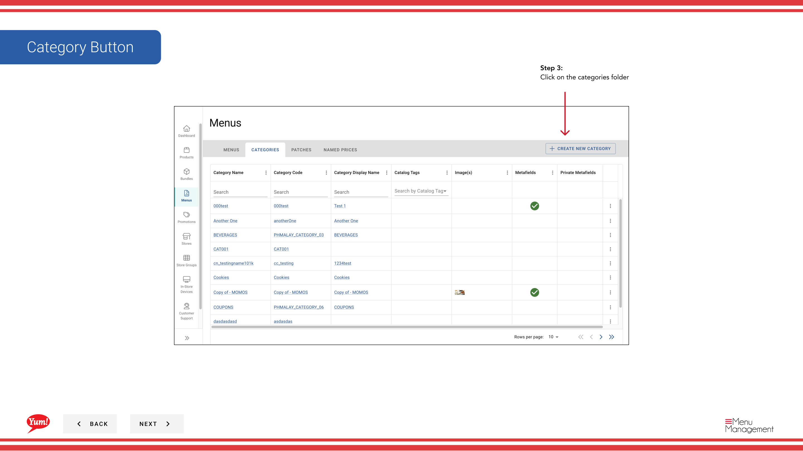
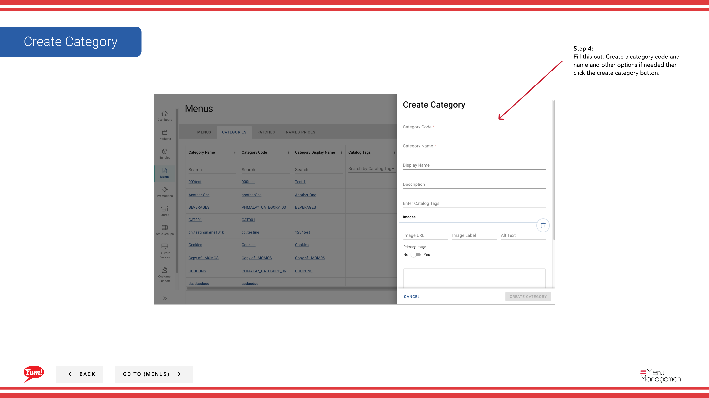

# Create a Category

## What this guide covers

Creates a grouping label (e.g. 'Chicken', 'Sides') within a menu to organise products for customers browsing the ordering interface.

## Steps

**Step 1:** Start by going to the Menu screen by clicking here.

**Step 2:** Click on the categories folder

**Step 3:** Click on the categories folder

**Step 4:** Fill this out. Create a category code and name and other options if needed then click the create category button.

## Additional information

- Menus - Create a Category

---

*Part of the [Admin Portal Guide](/docs/admin-portal-guide) · Section: Menus*