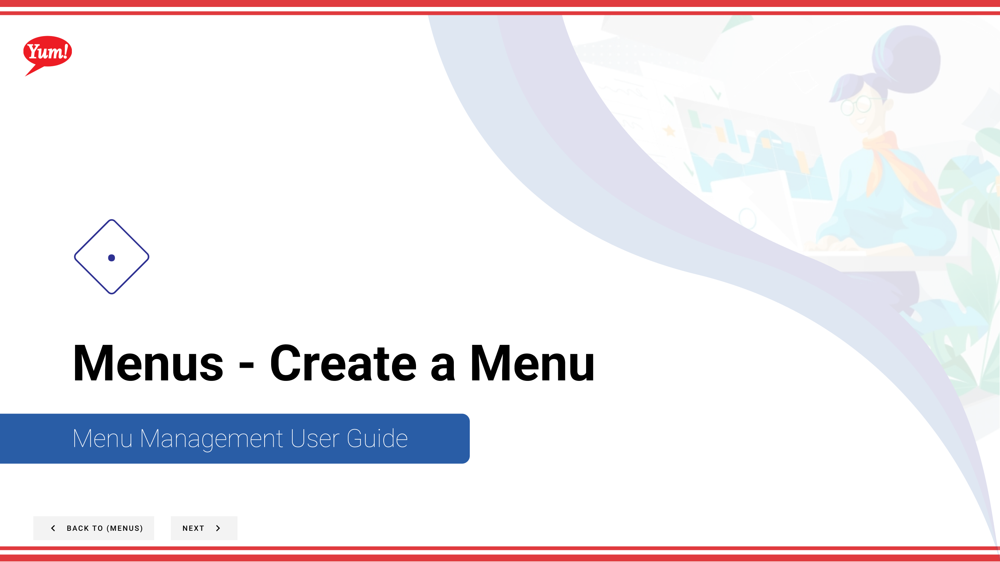
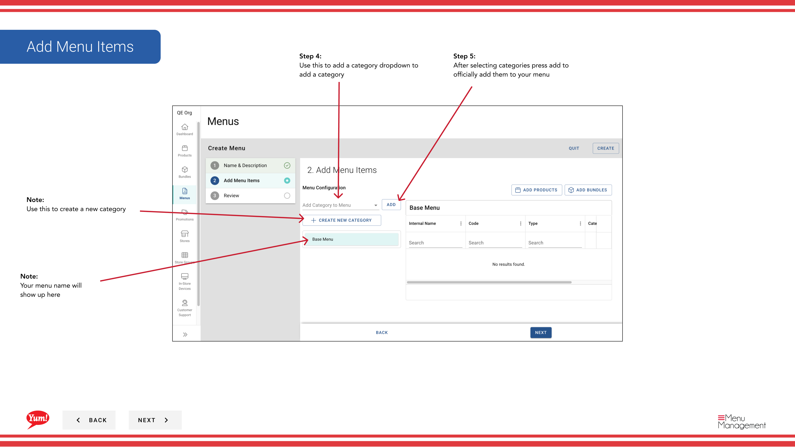

# Create a Menu

## What this guide covers

Builds a new menu structure in Atlas that can be assigned to stores and channels, defining the catalogue of products and bundles available for ordering.

## Steps

**Step 1:** Start by going to the Menu screen by clicking here.

**Step 2:** Click Create New Menu Button

**Step 3:** Create menu code and menu name.

**Step 4:** Use this to add a category dropdown to add a category

**Step 5:** After selecting categories press add to officially add them to your menu

**Step 6:** Use this to add a category dropdown to add a category. Drawers will pop that allow you to search for products/bundles to add once you select them hit add to menu

**Step 7:** Hit create when finished.

## Notes

:::note
Use this to create a new category
:::

:::note
Your menu name will show up here
:::

:::note
When you add category make sure to select it when you add products or bundles to it
:::

:::note
You can make a subcategory by dragging a category into another one
:::

## Additional information

- Menus - Create a Menu
- Create New Menu Button

---

*Part of the [Admin Portal Guide](/docs/admin-portal-guide) · Section: Menus*