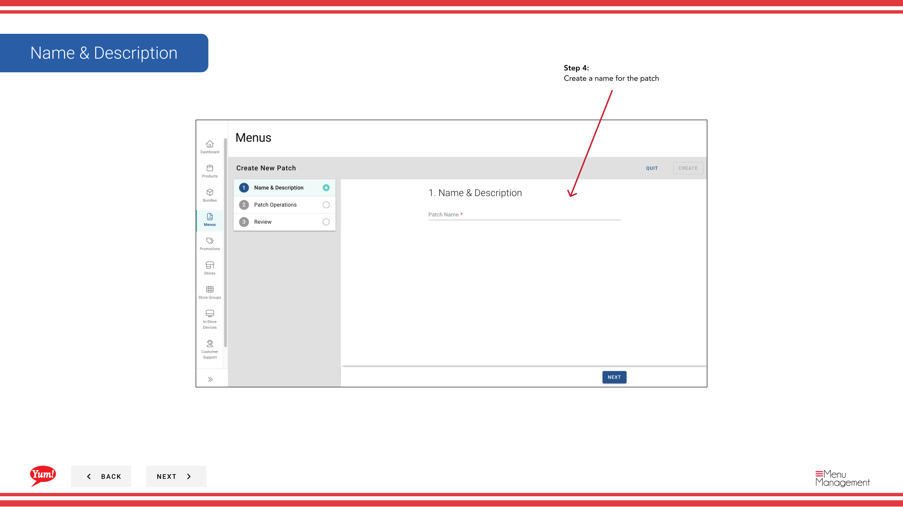
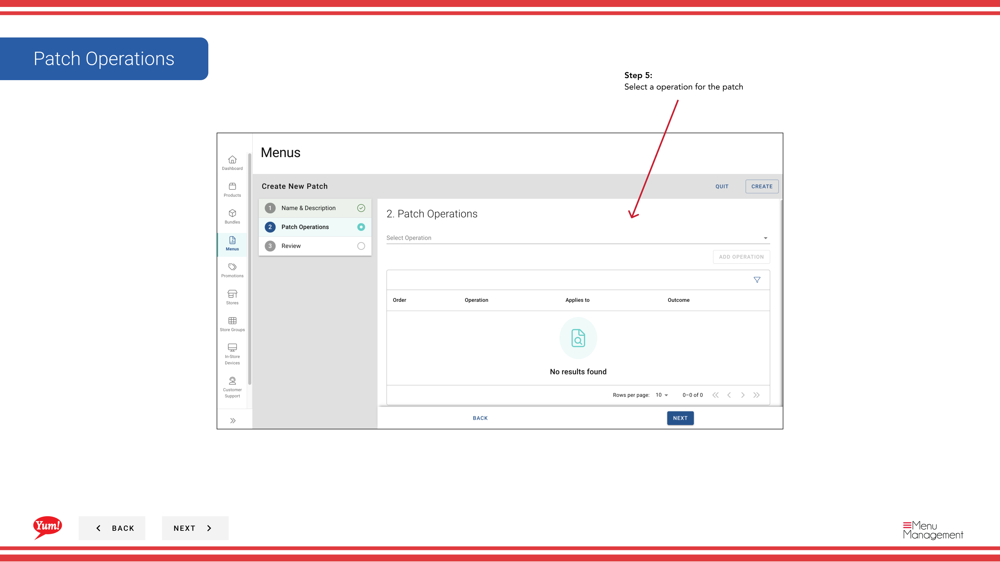
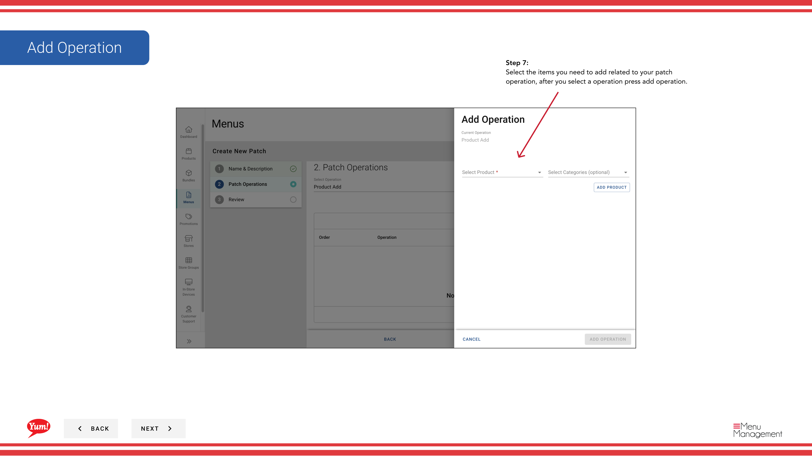

# Create a Patch

## What this guide covers

Creates a menu patch — a targeted override that modifies specific items (products, bundles, or variants) in a menu without replacing the entire menu. Commonly used for localized pricing or regional availability changes.

## Steps

**Step 1:** Navigate to the **Menus** section using the left-hand navigation menu.

**Step 2:** Click on the **Patches** tab to view all patches.

**Step 3:** Click the **Create New Patch** button.

**Step 4:** Enter a descriptive name for the patch. Fields marked with * are required.

| Field | What to enter | Notes |
|-------|--------------|-------|
| **Patch Name** * | A descriptive name for what this patch changes | e.g., “Sydney Q1 Pricing Override”, “Halal Menu Availability Fix”, “Regional Promo Discount”. Used to identify the patch in lists. |

**Step 5:** Select an **Operation** from the dropdown. This defines the type of change the patch will make.

| Operation | Purpose |
|-----------|---------|
| Price Override | Change the price of specific items |
| Availability Override | Enable or disable items at certain times |
| Item Enable/Disable | Turn items on or off |
| Other custom operations | Depends on your system setup |

**Step 6:** After selecting an operation, click **Add Operation** to proceed.

**Step 7:** Search for and select the specific products, variants, or bundles that this operation applies to. Once you have selected all needed items, click **Add Operation** to save them.

**Step 8:** You can add more operations to the same patch by repeating **Steps 5–7**. Each operation allows bundling related changes together.

**Step 9:** Once you have added all operations, click **Create** to save the patch.

:::tip
You can add multiple operations to a single patch to bundle related changes. For example, you can create one patch that includes both pricing overrides and availability changes for a regional promotion.
:::

:::note
Patches are not yet applied to stores. After creating a patch, you must assign it to stores using the “Assign a Patch” guides.
:::

## Related guides

- [Edit a Patch](/docs/admin-portal-guide/menus/edit-a-patch/) — Update a patch’s operations or items
- [Copy a Patch](/docs/admin-portal-guide/menus/copy-a-patch/) — Duplicate a patch as a starting point
- [Assign a Patch (Add to Patch List)](/docs/admin-portal-guide/menus/assign-a-patch-add-to-patch-list/) — Add this patch to a store’s active list
- [Delete a Patch](/docs/admin-portal-guide/menus/delete-a-patch/) — Remove a patch

---

*Part of the [Admin Portal Guide](/docs/admin-portal-guide) · Section: Menus*