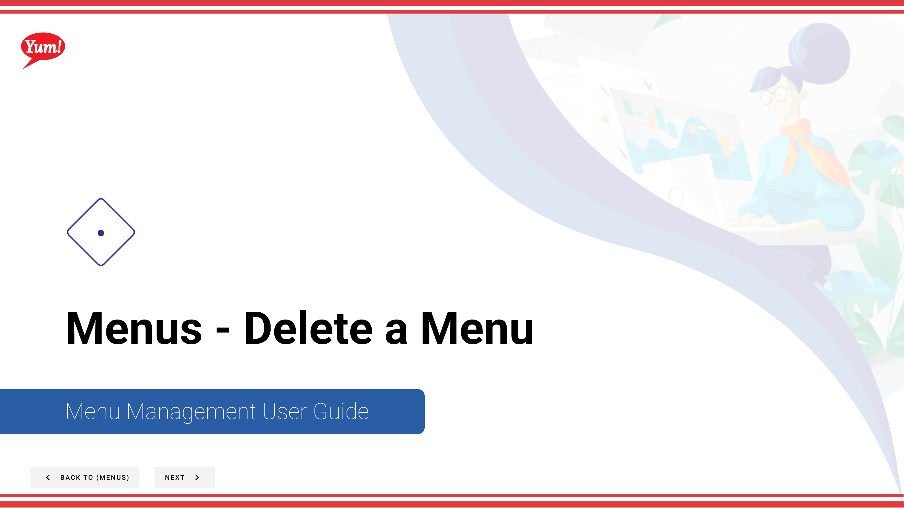

# Delete a Menu

## What this guide covers

Permanently removes a menu from the system when it is no longer in use.

## Steps

**Step 1:** Start by going to the Menu screen by clicking here.

**Step 2:** Click this button in the same row the menu you’re looking for is in and then hit Delete

**Step 3:** Click this button to delete the menu.

## Notes

:::note
Deleting this menu will remove it from all assigned stores. The live published menus at those stores won’t be impacted.
:::

## Additional information

- Menus - Delete a Menu

---

*Part of the [Admin Portal Guide](/docs/admin-portal-guide) · Section: Menus*