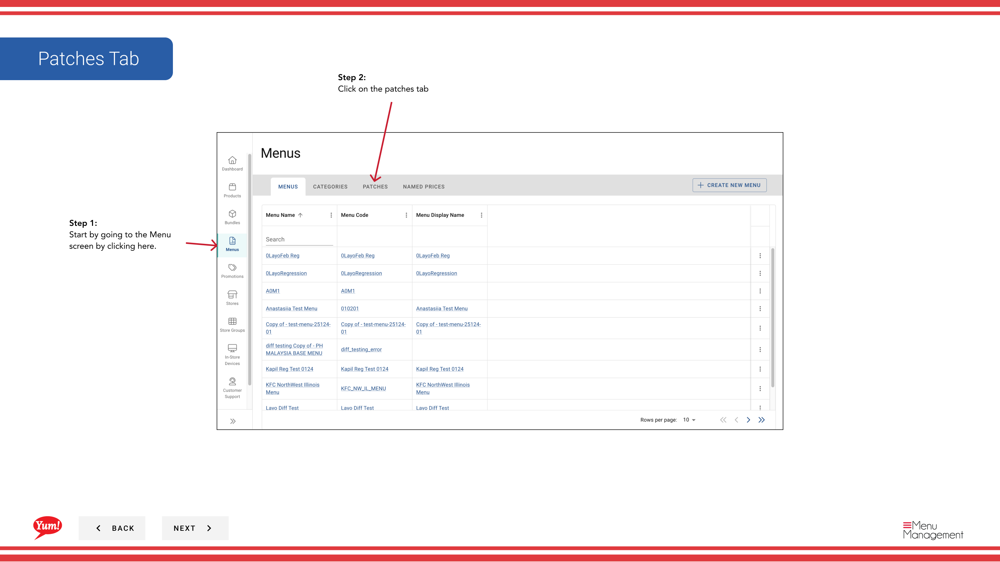

# Delete a Patch

## What this guide covers

Permanently removes a patch from the system.

## Steps

**Step 1:** Navigate to the **Menus** section using the left-hand navigation menu.

**Step 2:** Click on the **Patches** tab to view all patches.

**Step 3:** Find the patch you want to delete, click the **action menu** (three dots) in the same row, and select **Delete**.

**Step 4:** A confirmation dialog will appear. Click **Delete** to permanently remove the patch.

:::caution
Deleting a patch will remove it from all stores where it is actively assigned. If the patch is in a store’s patch list, it will be removed from that list. This action cannot be undone.
:::

## Related guides

- [Copy a Patch](/docs/admin-portal-guide/menus/copy-a-patch/) — Create a backup copy before deleting
- [Edit a Patch](/docs/admin-portal-guide/menus/edit-a-patch/) — Edit a patch instead of deleting it

---

*Part of the [Admin Portal Guide](/docs/admin-portal-guide) · Section: Menus*