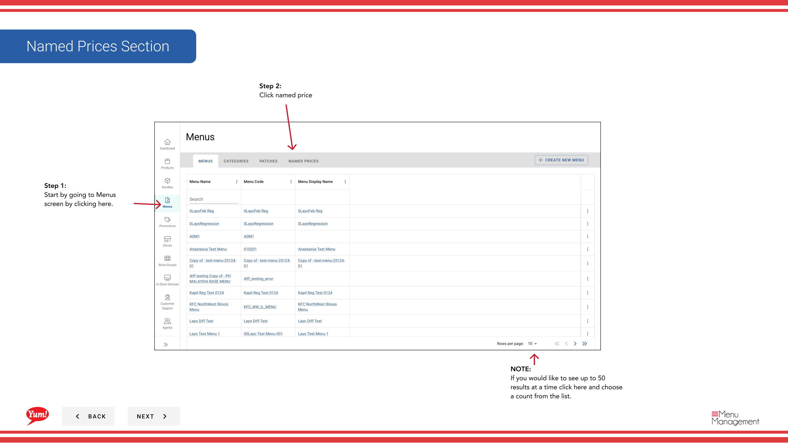

# Delete Named Price

## What this guide covers

Permanently removes a named price that is no longer in use. Deletes the price label only — products using it must be reassigned to a different price.

## Steps

**Step 1:** Navigate to the **Menus** section using the left-hand navigation menu.

**Step 2:** Click the **Named Prices** tab to view all named prices.

**Step 3:** Find the named price you want to delete in the list. You can use the search box to locate it or adjust the number of results displayed per page.

**Step 4:** Click the **action menu** (three dots) in the same row, then select **Delete**.

**Step 5:** A confirmation dialog will appear. Click the **Delete** button to permanently remove the named price.

:::caution
Deleting a named price will remove it from all products and variants that use it. Products will need to be reassigned to a different named price or a direct price value. This action cannot be undone. Before deleting, consider which products are using this price.
:::

## Related guides

- [Create a Named Price](/docs/admin-portal-guide/menus/create-a-named-price/) — Create a replacement named price if needed
- [Edit Named Price](/docs/admin-portal-guide/menus/edit-named-price/) — Update a named price instead of deleting it

---

*Part of the [Admin Portal Guide](/docs/admin-portal-guide) · Section: Menus*