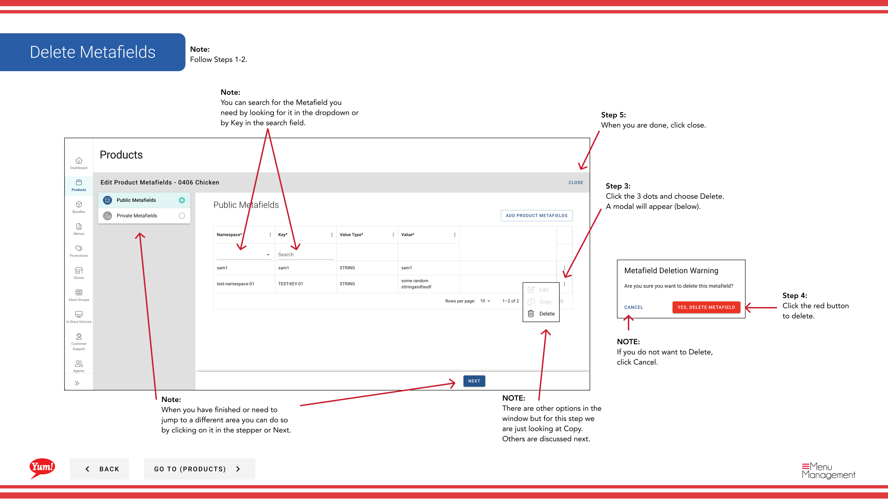

# Add Metafields to a Product

## What this guide covers

Lets operators attach structured custom data (public or private) to a product, enabling market-specific metadata such as nutritional information, regulatory tags, or integration fields required by local systems.

## Steps

**Step 1:** Start by going to the Products screen by clicking here.

**Step 2:** Click the 3 dots to reveal a panel. Click Copy.

**Step 3:** Click the here to open the drawer to fill in.

**Step 3:** Click the 3 dots and choose Edit. A drawer will pull out for you to edit.

**Step 3:** Click the 3 dots and choose Copy. A drawer will pull out for you to edit.

**Step 3:** Click the 3 dots and choose Delete. A modal will appear (below).

**Step 4:** Fill in each “*”required field and other valuable information.

**Step 4:** You can edit any of the enabled fields. Fill in each “*”required field and other valuable information.

**Step 4:** Click the red button to delete.

**Step 5:** When you go along filling in the info this button will turn blue, click it when you are done.

**Step 5:** When you are done, click close.

## Notes

:::note
You can search Products by entering the Name or Code.
:::

:::note
Depending on your screen size you may need to scroll to see the other columns.
:::

:::note
There are other options in the window  but for this step we are just looking at Meta. Others are discussed else where. Please go to the Table of Contents to find where.
:::

:::note
When you are done, click close.
:::

:::note
If you need to stop click Cancel. Please be aware that your info will not be saved.
:::

:::note
Adding Metafields to Public or Private is exactly the same.
:::

:::note
When you have finished or need to jump to a different area you can do so by clicking on it in the stepper or Next.
:::

:::note
Follow Steps 1-2.
:::

:::note
There are other options in the window but for this step we are just looking at Edit. Others are discussed next.
:::

:::note
You can search for the Metafield you need by looking for it in the dropdown or by Key in the search field.
:::

:::note
There are other options in the window but for this step we are just looking at Copy. Others are discussed next.
:::

:::note
If you do not want to Delete, click Cancel.
:::

## Additional information

- Add/Edit/Copy/Delete Meta Data to a Product

---

*Part of the [Admin Portal Guide](/docs/admin-portal-guide) · Section: Products*