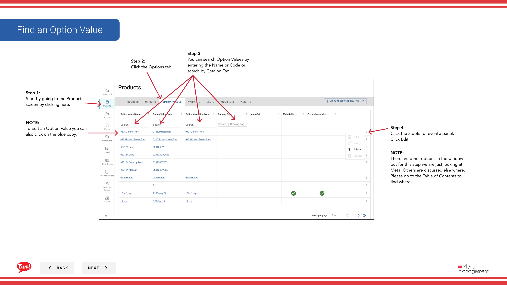
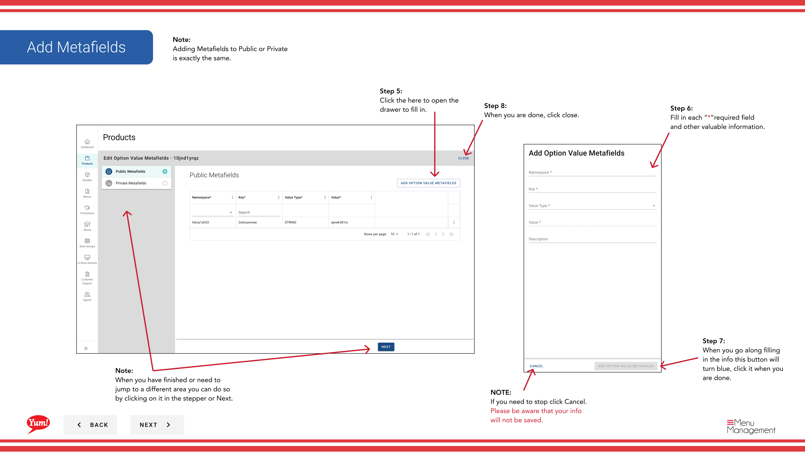
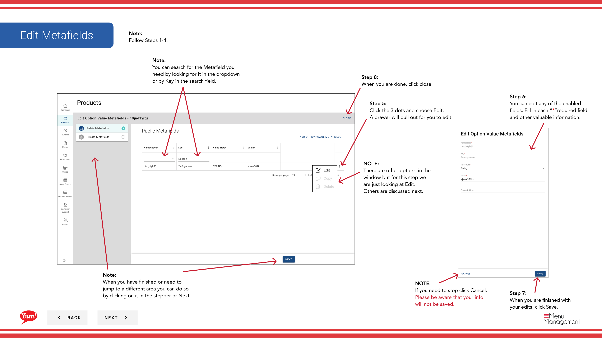
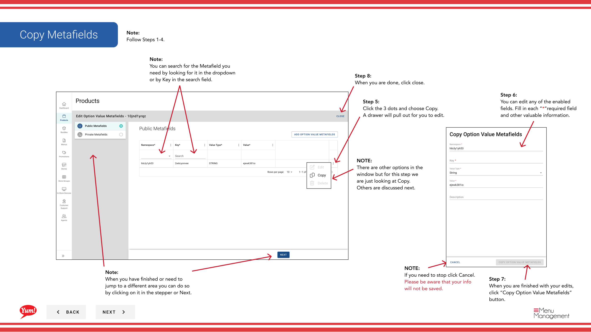

# Add Metafields to an Option Value

## What this guide covers

Attaches custom metadata to an option value for market-specific data requirements or system integration needs.

## Steps

**Step 1:** Navigate to the **Products** section using the left navigation menu.

**Step 2:** Click the **Option Values** tab.

**Step 3:** Search for the option value by entering the Name, Code, or Catalog Tag in the search field.

**Step 4:** Click the three-dot menu next to the option value, then select **Meta**.

**Step 5:** A drawer will open showing both **Public** and **Private** metafield sections.

**Step 6:** Click the **Add** button to add a new metafield.

**Step 7:** Fill in each metafield with the exact key and value your technical team has specified.

### To Edit an Existing Metafield

**Step 8:** Click the three-dot menu next to the metafield you want to edit, then select **Edit**.

**Step 9:** Update the key and value as needed, then click **Save**.

### To Copy a Metafield

**Step 10:** Click the three-dot menu next to the metafield you want to copy, then select **Copy**.

**Step 11:** A new metafield entry will be created with the same key and value. Edit if needed.

### To Delete a Metafield

**Step 12:** Click the three-dot menu next to the metafield you want to delete, then select **Delete**.

**Step 13:** Click the red **Delete** button to permanently remove the metafield.

**Step 14:** When you are finished, click **Close** to close the drawer.

## Notes

:::caution
Only add metafields if your technical team has specified the exact keys and values to use. Incorrect metafields may cause integration failures.
:::

:::tip
You can search for metafields by looking in the dropdown or by typing the key name in the search field.
:::

:::tip
Adding metafields to **Public** or **Private** follows the same process.
:::

:::caution
Deleting a metafield is permanent. Confirm you are removing the correct entry before clicking Delete.
:::

---

*Part of the [Admin Portal Guide](/docs/admin-portal-guide) · Section: Products*