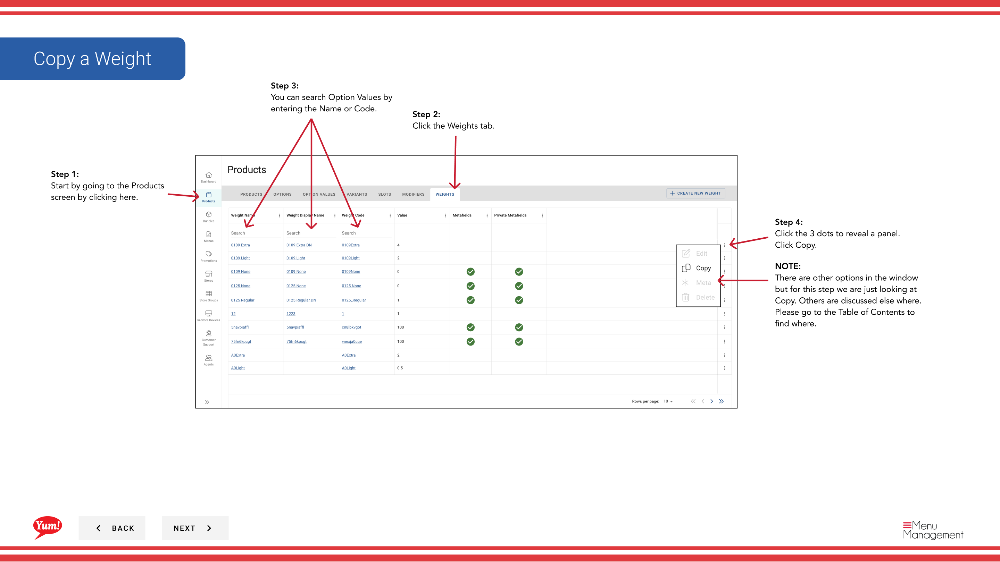

# Copy a Weight

## What this guide covers

Duplicates a weight entry to reduce setup time when creating similar weight configurations.

## Steps

**Step 1:** Navigate to the **Products** section using the left navigation menu.

**Step 2:** Click the **Weights** tab.

**Step 3:** Search for the weight you want to copy by entering the Weight Name or Weight Code in the search field.

**Step 4:** Click the three-dot menu next to the weight, then select **Copy**.

**Step 5:** The copy form will appear with the original weight's information. Update the fields as needed. Fields marked with * are required.

| Field | What to enter | Notes |
|-------|--------------|-------|
| **Weight Code** * | Unique identifier for the new weight | Must be different from the original (e.g., “WT-LARGE-COPY”) |
| **Weight Name** * | Describes the portion size | Can be the same or customized |
| **Max Weight Value** | Numeric maximum weight value | e.g., “500” (in grams or your unit) |
| **Default** | Toggle to mark as default | Only one weight should be marked as default per option |

**Step 6:** When you are finished adding all the information, click the **Create Weight** button.

## Notes

:::caution
The **Weight Code** must be unique. You cannot use the same code as the original weight.
:::

:::caution
Clicking **Cancel** discards all unsaved changes.
:::

:::tip
You can search weights by Weight Name or Weight Code.
:::

---

*Part of the [Admin Portal Guide](/docs/admin-portal-guide) · Section: Products*