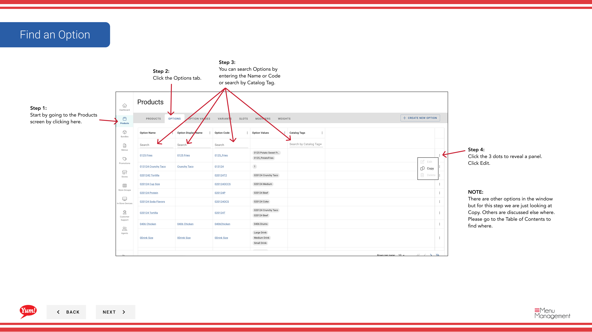
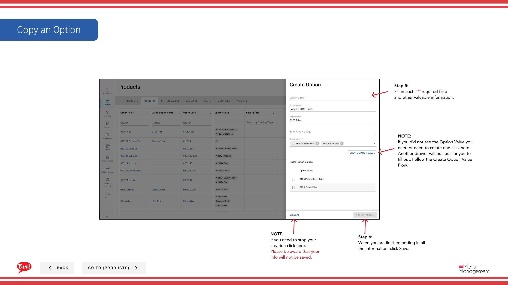

# Copy an Option

## What this guide covers

Duplicates an option group to save time when creating similar customisation sets across multiple products.

## Steps

**Step 1:** Start by going to the Products screen by clicking here.

**Step 2:** Click the Options tab.

**Step 3:** You can search Options by entering the Name or Code or search by Catalog Tag.

**Step 4:** Click the 3 dots to reveal a panel. Click Edit.

**Step 5:** Fill in each “*”required field and other valuable information.

**Step 6:** When you are finished adding in all the information, click Save.

## Notes

:::note
There are other options in the window  but for this step we are just looking at Copy. Others are discussed else where. Please go to the Table of Contents to find where.
:::

:::note
If you did not see the Option Value you need or need to create one click here. Another drawer will pull out for you to fill out. Follow the Create Option Value Flow.
:::

:::note
If you need to stop your creation click here. Please be aware that your info will not be saved.
:::

---

*Part of the [Admin Portal Guide](/docs/admin-portal-guide) · Section: Products*