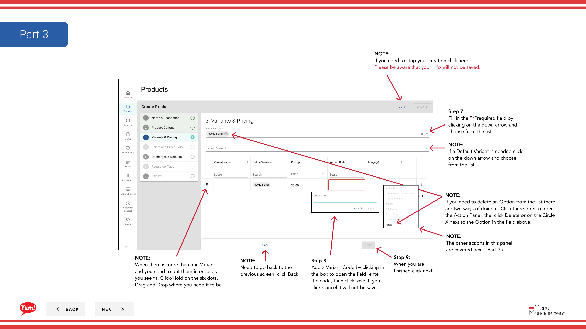
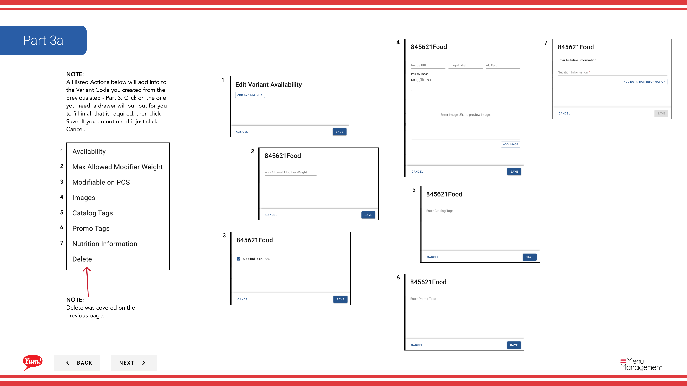
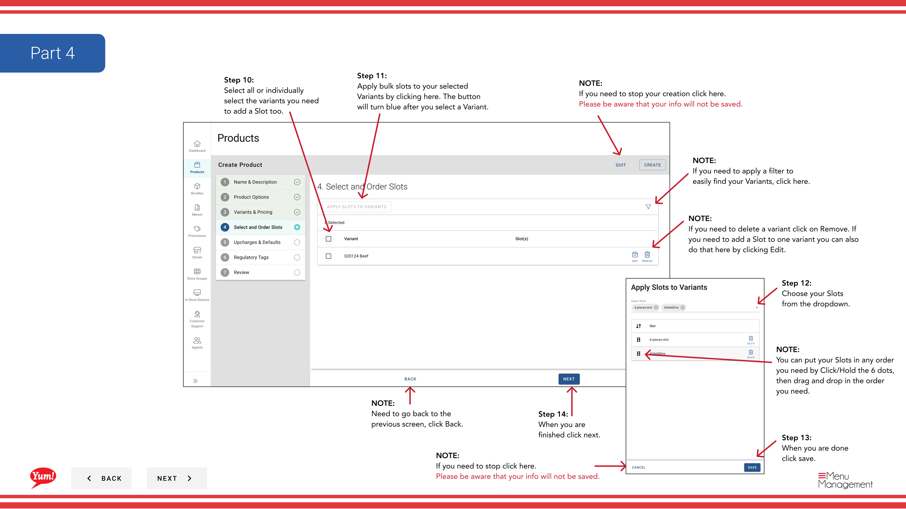
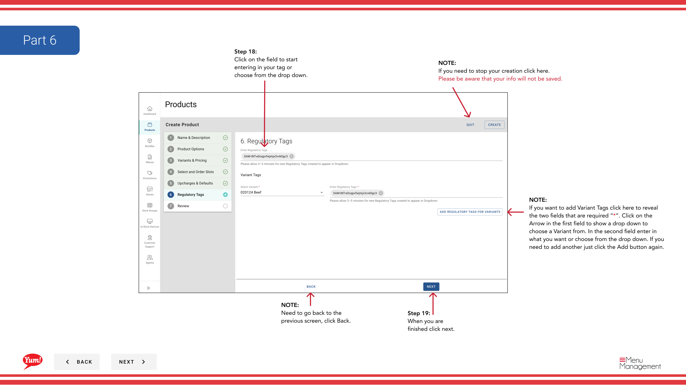

# Create a Product

## What this guide covers

Enables market operators to build a new menu item from scratch in Atlas, defining its product code, display name, variants, pricing, images, and item availability windows so it is ready to be included in menus and sold across digital channels.

## Steps

**Step 1:** Start by going to the Products screen by clicking here.

**Step 2:** Click the “+ Create New Product” button
**Step 3:** Fill in each “*”required field and other valuable information.

**Step 4:** When you are finished click next.

**Step 5:** Fill in the “*”required field by clicking on the down arrow and choose from the list.

**Step 6:** When you are finished click next.

**Step 7:** Fill in the “*”required field by clicking on the down arrow and choose from the list.

**Step 8:** Add a Variant Code by clicking in the box to open the field, enter the code, then click save. If you click Cancel it will not be saved.

**Step 9:** When you are finished click next.

**Step 10:** Select all or individually select the variants you need to add a Slot too.

**Step 11:** Apply bulk slots to your selected Variants by clicking here. The button will turn blue after you select a Variant.

**Step 12:** Choose your Slots from the dropdown.

**Step 13:** When you are done click save.

**Step 14:** When you are finished click next.

**Step 15:** Select all or individually select the variants you need to add needed info.

**Step 16:** Apply bulk actions to your selected Variants by clicking any of these 4 here. The button will turn blue after you select a Variant. Each will open a drawer which are shown next on Part 5a.

**Step 16a:** Apply individual actions to a selected Variant by clicking any of these 4 here. Each will open a drawer which are shown next on Part 5a.

**Step 17:** When you are finished click next.

**Step 18:** Click on the field to start entering in your tag or choose from the drop down.

**Step 19:** When you are finished click next.

**Step 20:** Take on last look at all the entered details making sure they are right. Depending on your screen sizes you may need to scroll down to see all of the products details.

**Step 21:** When you are finished reviewing click Create.

## Notes

:::note
Depending on your screen size you may need to scroll to see the other columns.
:::

:::note
Depending on your screen size you may need to expand your browser or scroll to see all of the input fields.
:::

:::note
If you need to add more than one image click here.
:::

:::note
If you need to add the item availability click here and a drawer will pull on that looks like this.
:::

:::note
If you need to stop your creation click here. Please be aware that your info will not be saved.
:::

:::note
When there is more than one Option and you need to put them in order as you see fit, Click on the six dots, Drag and Drop where you need it to be.
:::

:::note
Need to go back to the previous screen, click Back.
:::

:::note
If you don’t see your Option in the drop down list, click here to create it.
:::

:::note
If you need to delete an Option from the list there are two ways of doing it. Click the Delete or on the Circle X next to the Option in the field above.
:::

:::note
When there is more than one Variant and you need to put them in order as you see fit, Click/Hold on the six dots, Drag and Drop where you need it to be.
:::

:::note
If you need to delete an Option from the list there are two ways of doing it. Click three dots to open the Action Panel, the, click Delete or on the Circle X next to the Option in the field above.
:::

:::note
The other actions in this panel are covered next - Part 3a.
:::

:::note
If a Default Variant is needed click on the down arrow and choose from the list.
:::

:::note
If you need to delete a variant click on Remove. If you need to add a Slot to one variant you can also do that here by clicking Edit.
:::

:::note
If you need to stop click here. Please be aware that your info will not be saved.
:::

:::note
If you need to apply a filter to easily find your Variants, click here.
:::

:::note
You can put your Slots in any order you need by Click/Hold the 6 dots, then drag and drop in the order you need.
:::

:::note
If you want to add Variant Tags click here to reveal the two fields that are required “*”. Click on the Arrow in the first field to show a drop down to choose a Variant from. In the second field enter in what you want or choose from the drop down. If you need to add another just click the Add button again.
:::

:::note
If you need to go back to the specific step click on the Blue titles like this one.
:::

:::note
When you are done in each drawer click Save. Click cancel if you need to stop - Please be aware that your info will not be saved.
:::

:::note
Add pricing as needed in each field.
:::

:::note
Enter your max Weight Value here. Then select your default(s) from the active boxes shown.
:::

:::note
Add/Edit Nutrition info by clicking on the 3 dots and then Edit. If you need to add more click on the Add button.
:::

:::note
Chose your exclusions by checking all the boxes that apply.
:::

:::note
To apply a Range in pricing toggle to Yes and fill all necessary and required “*” fields. Need to add more click on the Add Range button after filling in the  first one.
:::

:::note
Delete was covered on the previous page.
:::

:::note
All listed Actions below will add info to the Variant Code you created from the previous step - Part 3. Click on the one you need, a drawer will pull out for you to fill in all that is required, then click Save. If you do not need it just click Cancel.
:::

---

*Part of the [Admin Portal Guide](/docs/admin-portal-guide) · Section: Products*