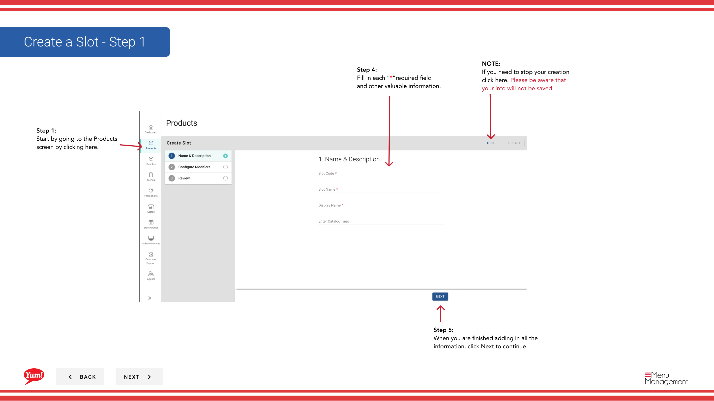

# Create a Slot

## What this guide covers

Defines a position within a product where a modifier or bundle choice can be placed, structuring how add-ons are presented to customers.

## Steps

**Step 1:** Start by going to the Products screen by clicking here.
**Step 2:** Click the Slots tab.

**Step 3:** Click the “+ Create New Slot” button.

**Step 4:** Fill in each “*”required field and other valuable information.

**Step 5:** When you are finished adding in all the information, click Next to continue.

**Step 6:** Choose all Modifiers needed from the drop down and then click the Add button.

**Step 7:** Choose all the Weights needed from the drop down and then click the Add button.

## Notes

:::note
If you need to stop your creation click here. Please be aware that your info will not be saved.
:::

:::note
If you do not see a Modifier you need click the Create New Modifier and follow the steps. Creating a Modifier will not be discussed in this flow.
:::

:::note
If you need to go back a step, click Back. Your info will not be lost by going back.
:::

:::note
After adding Modifiers a notification will let you know that you need to add Weights to the modifier.
:::

:::note
If your Modifiers will be using the same Weights, then check this box for a bulk action.
:::

:::note
If needed drag and drop them in the order you need them to be by clicking on the 6 Vertical dots.
:::

:::note
If you need to go back a step, click Back or on the step you need on the sides. Your info will not be lost by going back.
:::

## Additional information

- Create a Slot - Step 1
- Create a Slot - Step 2
- Create a Slot - Step 2, cont’d
- Create a Slot - Step 3

---

*Part of the [Admin Portal Guide](/docs/admin-portal-guide) · Section: Products*