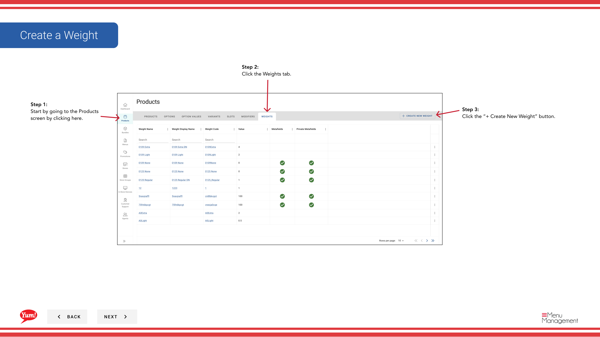

# Create a Weight

## What this guide covers

Defines a weight configuration for a product, used in markets where items are priced or tracked by weight.

## Steps

**Step 1:** Start by going to the Products screen by clicking here.
**Step 2:** Click the Weights tab.

**Step 3:** Click the “+ Create New Weight” button.

**Step 4:** Fill in each “*”required field and other valuable information.

**Step 5:** When you are finished adding in all the information, click the Create Weight button.

## Notes

:::note
If you need to stop your creation click here. Please be aware that your info will not be saved.
:::

---

*Part of the [Admin Portal Guide](/docs/admin-portal-guide) · Section: Products*