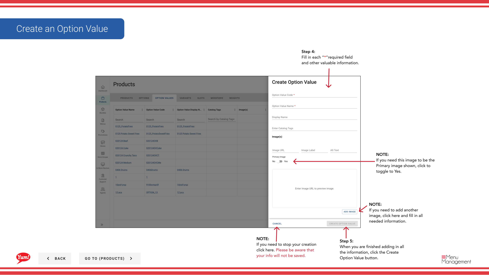

# Create an Option Value

## What this guide covers

Adds an individual choice within an option group (e.g., “Large” under “Size”), giving customers selectable items during ordering.

## Steps

**Step 1:** Navigate to the **Products** section using the left navigation menu.

**Step 2:** Click the **Option Values** tab.

**Step 3:** Click the **+ Create New Option Value** button.

**Step 4:** Fill in the option value details. Fields marked with * are required.

| Field | What to enter | Notes |
|-------|--------------|-------|
| **Option Value Code** * | Unique identifier for this choice | Use uppercase letters, numbers, and hyphens (e.g., “SIZE-LG”) |
| **Option Value Name** * | The choice displayed to customers | e.g., “Large”, “Original Recipe”, “Hot & Spicy” |
| **Display Name** | Shorter label for limited screen space | Defaults to Option Value Name if left blank |
| **Image** | Optional image for this choice | Toggle **Primary Image** to Yes if this is the main display image. Click **Add Another Image** to add more. |

**Step 5:** When you are finished adding all the information, click the **Create Option Value** button.

## Notes

:::caution
Clicking **Cancel** discards all unsaved information.
:::

:::tip
Toggle **Primary Image** to **Yes** to set this image as the main display image for this option value.
:::

:::tip
You can add multiple images by clicking **Add Another Image**.
:::

---

*Part of the [Admin Portal Guide](/docs/admin-portal-guide) · Section: Products*