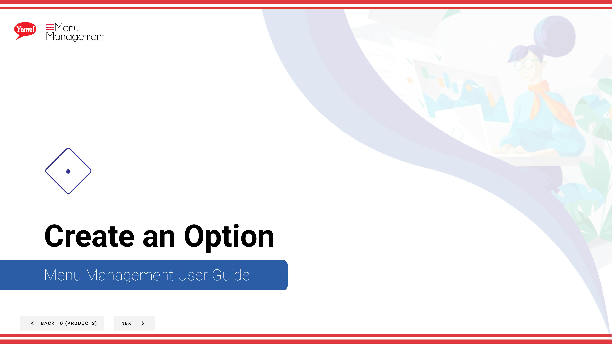

# Create an Option

## What this guide covers

Creates a customisation group (e.g. 'Size', 'Spice Level') that can be linked to products, allowing customers to personalise their order.

## Steps

**Step 1:** Start by going to the Products screen by clicking here.

**Step 2:** Click the Options tab.

**Step 3:** Click the “+ Create New Option” button.

---

*Part of the [Admin Portal Guide](/docs/admin-portal-guide) · Section: Products*