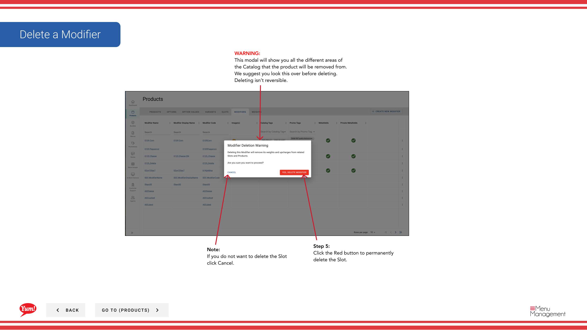

# Delete a Modifier

## What this guide covers

Permanently removes a modifier from the system when it is no longer needed.

## Steps

**Step 1:** Navigate to the **Products** section using the left navigation menu.

**Step 2:** Click the **Modifiers** tab.

**Step 3:** Search for the modifier you want to delete by entering the Name, Code, or Catalog Tag in the search field.

**Step 4:** Click the three-dot menu next to the modifier, then select **Delete**.

**Step 5:** A confirmation modal will appear showing all the areas of the system where this modifier is used. Review this carefully to ensure you are deleting the correct modifier.

**Step 6:** Click the red **Delete** button to permanently remove the modifier.

## Notes

:::caution
Deleting a modifier is permanent and cannot be undone. The modifier will be removed from all slots and products that use it.
:::

:::tip
You can search modifiers by Name, Code, or Catalog Tag to quickly find the item you want to delete.
:::

:::caution
Click **Cancel** if you do not want to proceed with deletion.
:::

---

*Part of the [Admin Portal Guide](/docs/admin-portal-guide) · Section: Products*