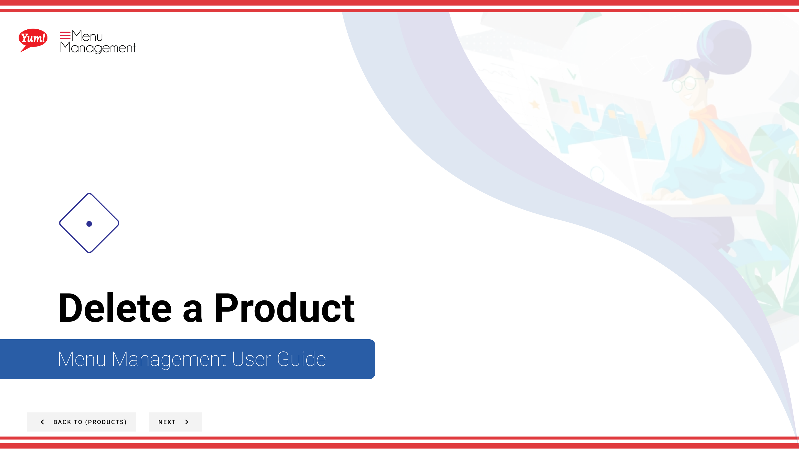
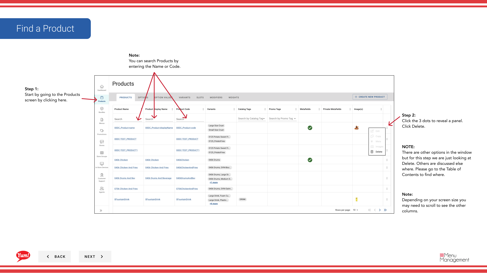

# Delete a Product

## What this guide covers

Permanently removes a product from the Atlas catalogue, used when an item is discontinued or was created in error.

## Steps

**Step 1:** Start by going to the Products screen by clicking here.

**Step 2:** Click the 3 dots to reveal a panel. Click Delete.

**Step 3:** Click the Red button to permanently delete the Product.

## Notes

:::note
You can search Products by entering the Name or Code.
:::

:::note
Depending on your screen size you may need to scroll to see the other columns.
:::

:::note
There are other options in the window  but for this step we are just looking at Delete. Others are discussed else where. Please go to the Table of Contents to find where.
:::

:::note
If you do not want to delete the Product click Cancel.
:::

## Additional information

- WARNING: This modal will show you all the different areas of the Catalog that the product will be removed from. We suggest you look this over before deleting. Deleting isn’t reversible.

---

*Part of the [Admin Portal Guide](/docs/admin-portal-guide) · Section: Products*