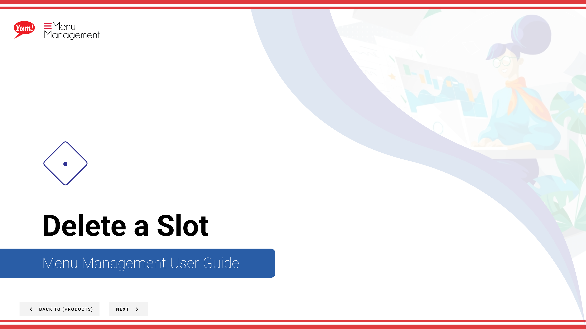

# Delete a Slot

## What this guide covers

Removes a slot from a product when the configuration is no longer needed.

## Steps

**Step 1:** Start by going to the Products screen by clicking here.

**Step 2:** Click the Slots tab.

**Step 3:** You can search Slots by entering the Names or Codes or by Tags.

**Step 4:** Click the 3 dots to reveal a panel. Click Delete.

**Step 5:** Click the Red button to permanently delete the Slot.

## Notes

:::note
If you do not want to delete the Slot click Cancel.
:::

:::note
There are other options in the window  but for this step we are just looking at Delete. Others are discussed else where. Please go to the Table of Contents to find where.
:::

## Additional information

- Delete an Option Value
- WARNING: This modal will show you all the different areas of the Catalog that the product will be removed from. We suggest you look this over before deleting. Deleting isn’t reversible.

---

*Part of the [Admin Portal Guide](/docs/admin-portal-guide) · Section: Products*