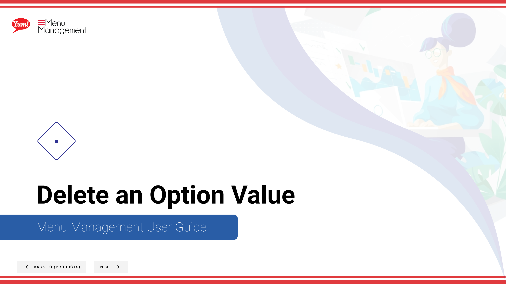

# Delete an Option Value

## What this guide covers

Removes a specific choice from an option group when it is discontinued.

## Steps

**Step 1:** Start by going to the Products screen by clicking here.

**Step 2:** Click the Option Values tab.

**Step 3:** You can search Option Values by entering the Name or Code or search by Catalog Tag.

**Step 4:** Click the 3 dots to reveal a panel. Click Delete.

**Step 5:** Click the Red button to permanently delete the Option Value.

## Notes

:::note
There are other options in the window  but for this step we are just looking at Delete. Others are discussed else where. Please go to the Table of Contents to find where.
:::

:::note
To Edit an Option Value you can also click on the blue copy.
:::

:::note
If you do not want to delete the Option Value click Cancel.
:::

## Additional information

- Delete an Option Value
- WARNING: This modal will show you all the different areas of the Catalog that the product will be removed from. We suggest you look this over before deleting. Deleting isn’t reversible.

---

*Part of the [Admin Portal Guide](/docs/admin-portal-guide) · Section: Products*