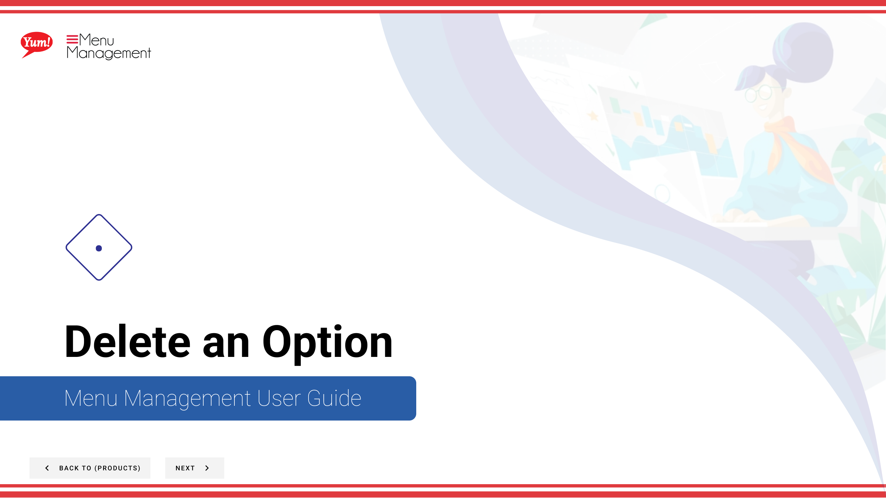
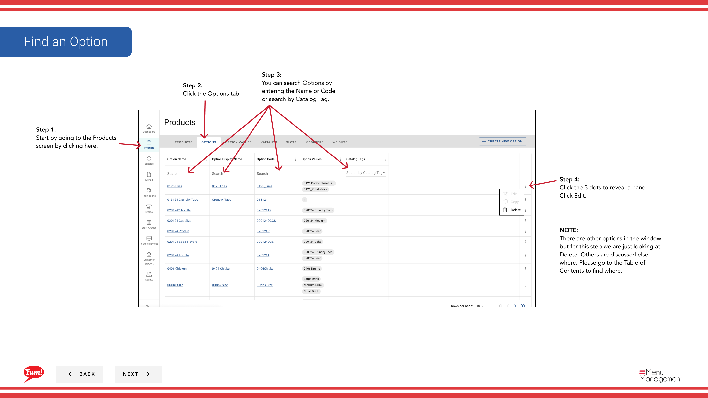

# Delete an Option

## What this guide covers

Removes an option group from the system when it is no longer needed.

## Steps

**Step 1:** Start by going to the Products screen by clicking here.

**Step 2:** Click the Options tab.

**Step 3:** You can search Options by entering the Name or Code or search by Catalog Tag.

**Step 4:** Click the 3 dots to reveal a panel. Click Edit.

**Step 5:** Click the Red button to permanently delete the Option.

## Notes

:::note
There are other options in the window  but for this step we are just looking at Delete. Others are discussed else where. Please go to the Table of Contents to find where.
:::

:::note
If you do not want to delete the Option click Cancel.
:::

## Additional information

- WARNING: This modal will show you all the different areas of the Catalog that the product will be removed from. We suggest you look this over before deleting. Deleting isn’t reversible.

---

*Part of the [Admin Portal Guide](/docs/admin-portal-guide) · Section: Products*