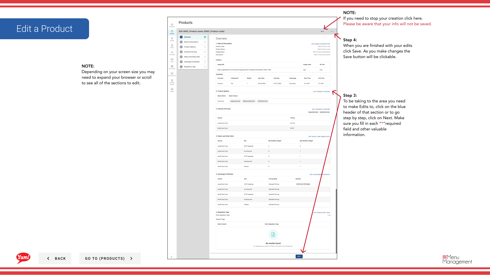

# Edit a Product

## What this guide covers

Updates an existing product's information such as name, description, images, pricing, or availability to reflect menu changes, corrections, or branding updates without recreating the item.

## Steps

**Step 1:** Navigate to the **Products** section using the left navigation menu.

**Step 2:** Find the product you want to edit. You can search by entering the Product Name or Product Code in the search field.

**Step 3:** Click the three-dot menu next to the product name, then select **Edit**.

**Step 4:** You will see the edit form with all pages from the creation process. To jump directly to a section, click on the blue section header (e.g., “Basic Information”, “Options”, “Variants”). To navigate step-by-step, click **Next**.

**Step 5:** Make your changes. Fields marked with * are required. Only the **Save** button will be active when you have made changes.

**Step 6:** When you have finished your edits, click the **Save** button.

## Notes

:::caution
Clicking **Cancel** discards all unsaved changes.
:::

:::tip
You can search products by Product Name or Product Code to quickly find the item you want to edit.
:::

:::tip
Click the blue section headers to jump directly to the section you want to edit instead of navigating step-by-step.
:::

---

*Part of the [Admin Portal Guide](/docs/admin-portal-guide) · Section: Products*