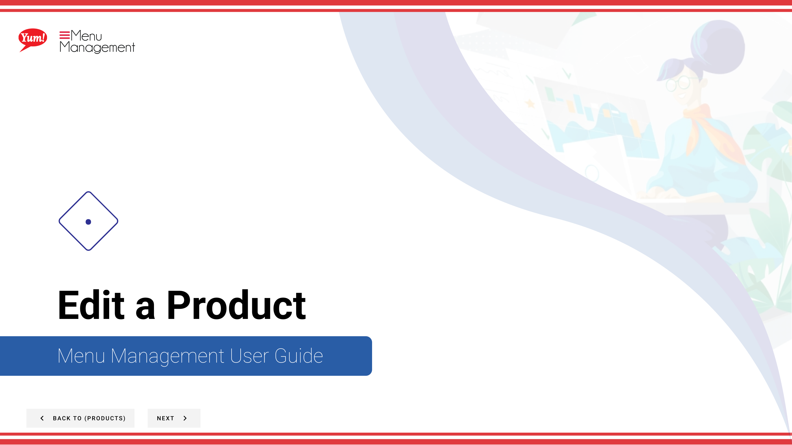

# Edit a Product

## What this guide covers

Allows operators to update an existing product's name, description, images, or other fields to reflect menu changes, pricing corrections, or branding updates without needing to recreate the item.

## Steps

**Step 1:** Start by going to the Products screen by clicking here.

**Step 2:** Click the 3 dots to reveal a panel. Click Edit.

**Step 3:** To be taking to the area you need to make Edits to, click on the blue header of that section or to go step by step, click on Next. Make sure you fill in each “*”required field and other valuable information.

**Step 4:** When you are finished with your edits click Save. As you make changes the Save button will be clickable.

## Notes

:::note
Depending on your screen size you may need to expand your browser or scroll to see all of the sections to edit.
:::

:::note
If you need to stop your creation click here. Please be aware that your info will not be saved.
:::

:::note
You can search Products by entering the Name or Code.
:::

:::note
Depending on your screen size you may need to scroll to see the other columns.
:::

:::note
There are other options in the window  but for this step we are just looking at Edit. Others are discussed else where. Please go to the Table of Contents to find where.
:::

---

*Part of the [Admin Portal Guide](/docs/admin-portal-guide) · Section: Products*