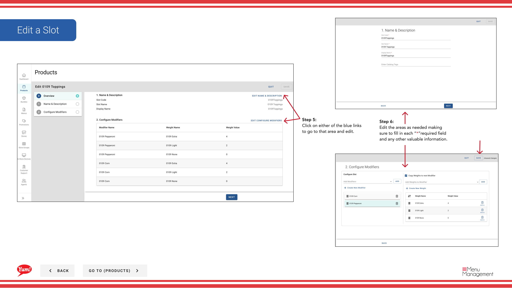

# Edit a Slot

## What this guide covers

Updates an existing slot's configuration, such as its label, minimum/maximum quantities, modifiers, or weights.

## Steps

**Step 1:** Navigate to the **Products** section using the left navigation menu.

**Step 2:** Click the **Slots** tab.

**Step 3:** Search for the slot you want to edit by entering the Slot Name, Slot Code, or Tag in the search field.

**Step 4:** Click the three-dot menu next to the slot, then select **Edit**.

**Step 5:** You will see the slot details with blue section links. Click on any blue link to jump directly to that section:
- **Basic Information** — Edit slot code, name, min/max quantities
- **Modifiers** — Add, remove, or reorder modifiers
- **Weights** — Add, remove, or reorder weight options

**Step 6:** Edit the areas as needed. Fields marked with * are required.

| Field | What to enter | Notes |
|-------|--------------|-------|
| **Slot Code** * | Unique identifier | Cannot be changed after creation |
| **Slot Name** * | Describes what customisation this slot offers | e.g., “Sauce Selection”, “Cheese Options” |
| **Min Quantity** | Minimum modifier selections required | 0 = optional |
| **Max Quantity** | Maximum modifier selections allowed | Leave blank for unlimited |

**Step 7:** When finished with your edits, click the **Save** button.

## Notes

:::caution
Clicking **Cancel** discards all unsaved changes.
:::

:::tip
You can jump directly to a section by clicking the blue section link instead of scrolling.
:::

:::tip
You can search slots by Slot Name, Slot Code, or Tag to quickly find the item you want to edit.
:::

---

*Part of the [Admin Portal Guide](/docs/admin-portal-guide) · Section: Products*