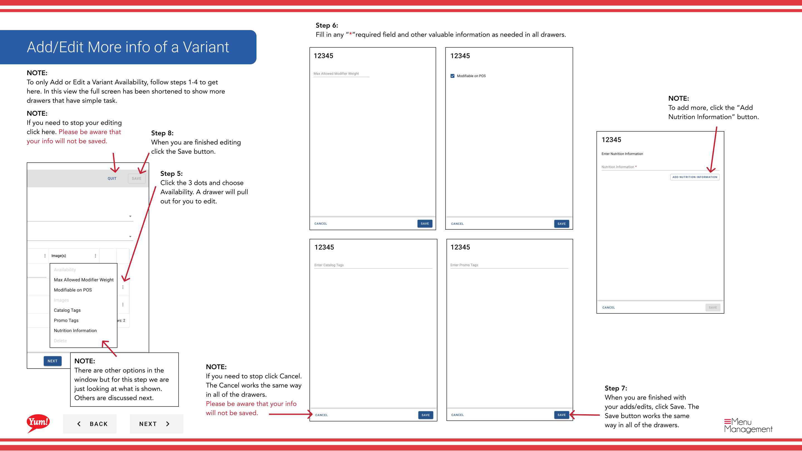
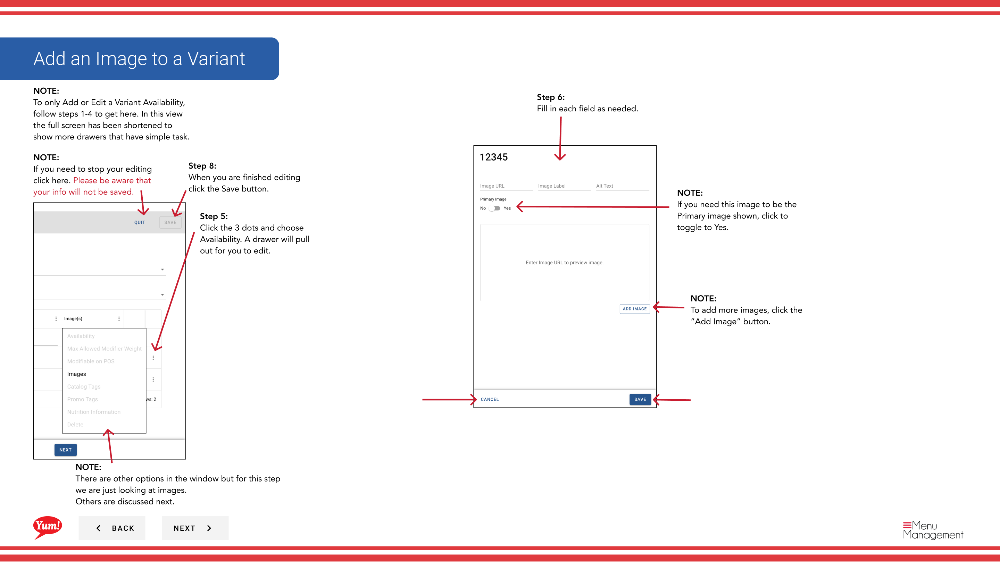
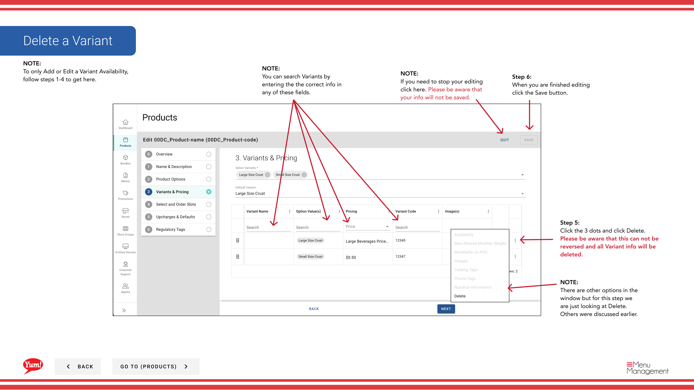

# Edit a Variant

## What this guide covers

Configures a product variant (a specific combination of options with its own price and code), allowing operators to set pricing, availability, and linked slots for each purchasable version of a product.

## Steps

**Step 1:** Start by going to the Products screen by clicking here.

**Step 2:** Click the Variants tab.
**Step 3:** You can search Variants by entering the Product Name or Option Values or by Tags.

**Step 4:** Click the 3 dots to reveal a panel. Click Edit.

**Step 5:** Fill in each “*”required field and other valuable information.

**Step 5:** Click the 3 dots and choose Availability. A drawer will pull out for you to edit.

**Step 5:** Click the 3 dots and click Delete.  Please be aware that this can not be reversed and all Variant info will be deleted.

**Step 6:** To add a Variant Code click inside the red box to reveal this drop down to fill in. Click Save when you are done.

**Step 6:** Fill in each “*”required field and other valuable information.

**Step 6:** When you are finished editing click the Save button.

**Step 6:** Fill in any “*”required field and other valuable information as needed in all drawers.

**Step 6:** Fill in each field as needed.

**Step 7:** When you are finished editing click the Save button.

**Step 7:** When you are finished with your edits, click Save.

**Step 7:** When you are finished with your adds/edits, click Save. The Save button works the same way in all of the drawers.

**Step 8:** When you are finished editing click the Save button.

## Notes

:::note
There are other options in the window  but for this step we are just looking at Edit. Others are discussed else where. Please go to the Table of Contents to find where.
:::

:::note
After adding or editing a price, click Save.
:::

:::note
If you need to stop your editing click here. Please be aware that your info will not be saved.
:::

:::note
When you add a new variant this warning will appear to let you know something needs to be filled in.
:::

:::note
If you need to edit or add a price just click in the box to reveal this drop down to edit or add.
:::

:::note
You can search Variants by entering the the correct info in any of these fields.
:::

:::note
To only Add or Edit a Variant Availability, follow steps 1-4 to get here.
:::

:::note
There are other options in the window but for this step we are just looking at Availability. Others are discussed next.
:::

:::note
If you need to stop click Cancel. Please be aware that your info will not be saved.
:::

:::note
To add another, click the “Add Availability” button.
:::

:::note
There are other options in the window but for this step we are just looking at Delete. Others were discussed earlier.
:::

:::note
To only Add or Edit a Variant Availability, follow steps 1-4 to get here. In this view the full screen has been shortened to show more drawers that have simple task.
:::

:::note
There are other options in the window but for this step we are just looking at what is shown. Others are discussed next.
:::

:::note
If you need to stop click Cancel. The Cancel works the same way in all of the drawers. Please be aware that your info will not be saved.
:::

:::note
To add more, click the “Add Nutrition Information” button.
:::

:::note
There are other options in the window but for this step we are just looking at images. Others are discussed next.
:::

:::note
To add more images, click the “Add Image” button.
:::

:::note
If you need this image to be the Primary image shown, click to toggle to Yes.
:::

## Additional information

- Add/Edit Availability to a Variant
- Add/Edit More info of a Variant
- Add an Image to a Variant

---

*Part of the [Admin Portal Guide](/docs/admin-portal-guide) · Section: Products*