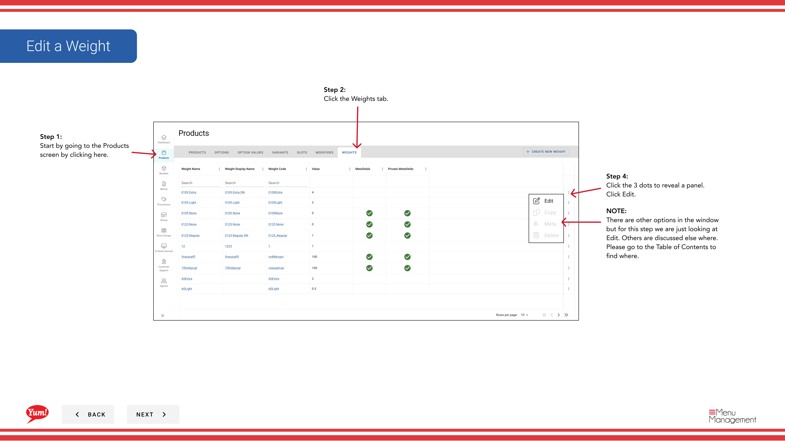
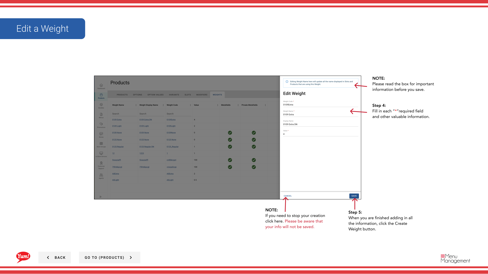

# Edit a Weight

## What this guide covers

Updates an existing weight definition.

## Steps

**Step 1:** Start by going to the Products screen by clicking here.
**Step 2:** Click the Weights tab.

**Step 4:** Click the 3 dots to reveal a panel. Click Edit.

**Step 4:** Fill in each “*”required field and other valuable information.

**Step 5:** When you are finished adding in all the information, click the Create Weight button.

## Notes

:::note
There are other options in the window  but for this step we are just looking at Edit. Others are discussed else where. Please go to the Table of Contents to find where.
:::

:::note
If you need to stop your creation click here. Please be aware that your info will not be saved.
:::

:::note
Please read the box for important information before you save.
:::

---

*Part of the [Admin Portal Guide](/docs/admin-portal-guide) · Section: Products*