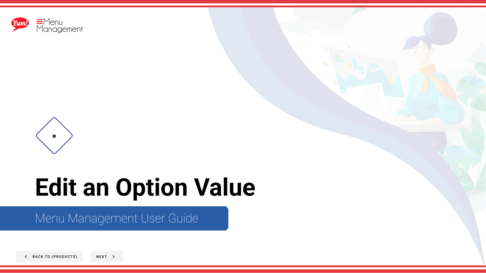

# Edit an Option Value

## What this guide covers

Updates the name, pricing, or properties of an existing option value.

## Steps

**Step 1:** Start by going to the Products screen by clicking here.

**Step 2:** Click the Options tab.

**Step 3:** You can search Option Values by entering the Name or Code or search by Catalog Tag.

**Step 4:** Click the 3 dots to reveal a panel. Click Edit.

**Step 5:** Fill in each “*”required field and other valuable information.

**Step 6:** When you are finished editing click the Save button.

## Notes

:::note
If you need to stop your creation click here. Please be aware that your info will not be saved.
:::

:::note
If you need this image to be the Primary image shown, click to toggle to Yes.
:::

:::note
If you need to add another image, click here and fill in all needed information.
:::

:::note
Please read the box below for important information before you save.
:::

:::note
There are other options in the window  but for this step we are just looking at Edit. Others are discussed else where. Please go to the Table of Contents to find where.
:::

:::note
To Edit an Option Value you can also click on the blue copy.
:::

---

*Part of the [Admin Portal Guide](/docs/admin-portal-guide) · Section: Products*