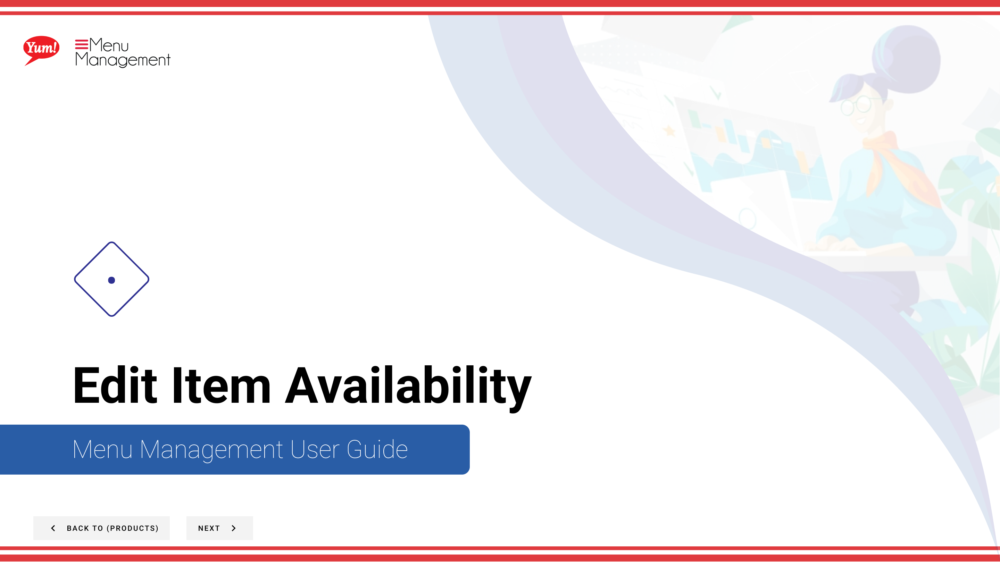

# Edit Item Availability

## What this guide covers

Controls when a modifier is available for ordering by setting occasion windows, date ranges, and time slots — useful for limited-time offers or daypart restrictions.

## Steps

**Step 1:** Start by going to the Products screen by clicking here.

**Step 2:** Click the Modifiers tab.

**Step 3:** You can search Option Values by entering the Name or Code or search by Catalog Tag.

**Step 4:** Click the 3 dots to reveal a panel. Click Availability.

**Step 6:** Fill in each “*”required field and other valuable information.

**Step 7:** When you are finished with your edits, click Save.

## Notes

:::note
There are other options in the window  but for this step we are just looking at Availability. Others are discussed else where. Please go to the Table of Contents to find where.
:::

:::note
If you need to stop click Cancel. Please be aware that your info will not be saved.
:::

:::note
To add another, click the “Add Availability” button.
:::

## Additional information

- Edit Item Availability
- Add/Edit Availability to a Variant

---

*Part of the [Admin Portal Guide](/docs/admin-portal-guide) · Section: Products*