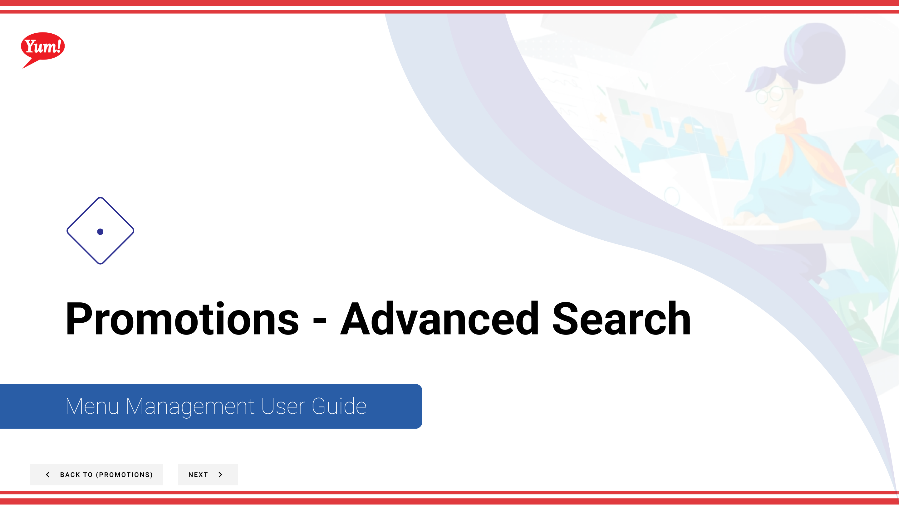

# Advanced Promotions Search

## What this guide covers

Provides enhanced filtering and search capabilities across all promotions, allowing operators to locate specific promotions by complex criteria.

## Steps

**Step 1:** Start by going to the Promotions screen by clicking here.

**Step 2:** Click the Store Groups tab

**Step 3:** Click the “Advanced Search” button

**Step 4:** Select the target item by whether it is in promotion requirements, promotion effects or both (defined when creating the promotion)

**Step 4:** Click the search button to perform the search and populate the table in the advanced promotion search screen

**Step 5:** Filter down to the specific item you’re looking for by selecting item type or promo tag then select the single item or promo tag you want to search for

## Additional information

- Promotions - Advanced Search
- This is the Promotions screen where you  will see a list of all the promotions you have created, create new promotions, search for any you have created, edit and copy, add extra info in the Meta link and  assign them to Store Groups.  Promotions can only assigned to a Store Group and not a singular store.
- If your search parameters match an existing promotion, the table will show the name of the promotion, the description that was entered at the time the promotion was created, and how many times the item you searched for show up in requirements and/or effects.  If the table says “no results found” try again with different search parameters.

---

*Part of the [Admin Portal Guide](/docs/admin-portal-guide) · Section: Promotions*