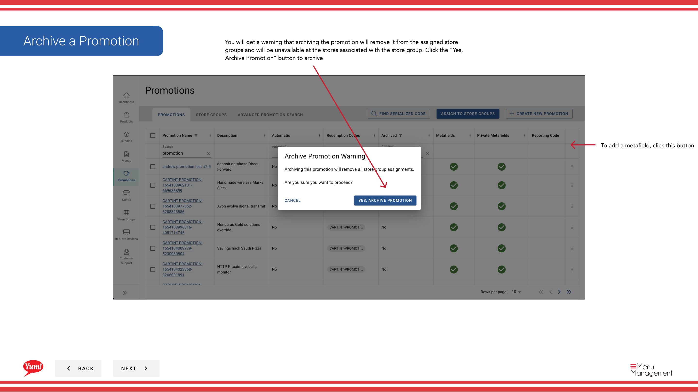
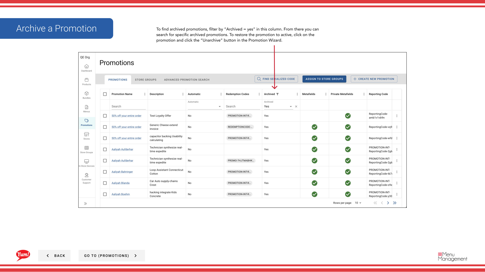

# Archive a Promotion

## What this guide covers

Marks a promotion as archived to remove it from active use while retaining its record for historical reporting.

## Steps

**Step 1:** Start by going to the Promotions screen by clicking here.
**Step 2:** Find the promotion you want to archive, click the action button, then click “Archive”

## Additional information

- This is the Promotions screen where you  will see a list of all the promotions you have created, create new promotions, search for any you have created, edit and copy, add extra info in the Meta link and  assign them to Store Groups.  Promotions can only assigned to a Store Group and not a singular store.
- You will get a warning that archiving the promotion will remove it from the assigned store groups and will be unavailable at the stores associated with the store group. Click the “Yes, Archive Promotion” button to archive
- To add a metafield, click this button
- To find archived promotions, filter by “Archived = yes” in this column. From there you can search for specific archived promotions. To restore the promotion to active, click on the promotion and click the “Unarchive” button in the Promotion Wizard.

---

*Part of the [Admin Portal Guide](/docs/admin-portal-guide) · Section: Promotions*