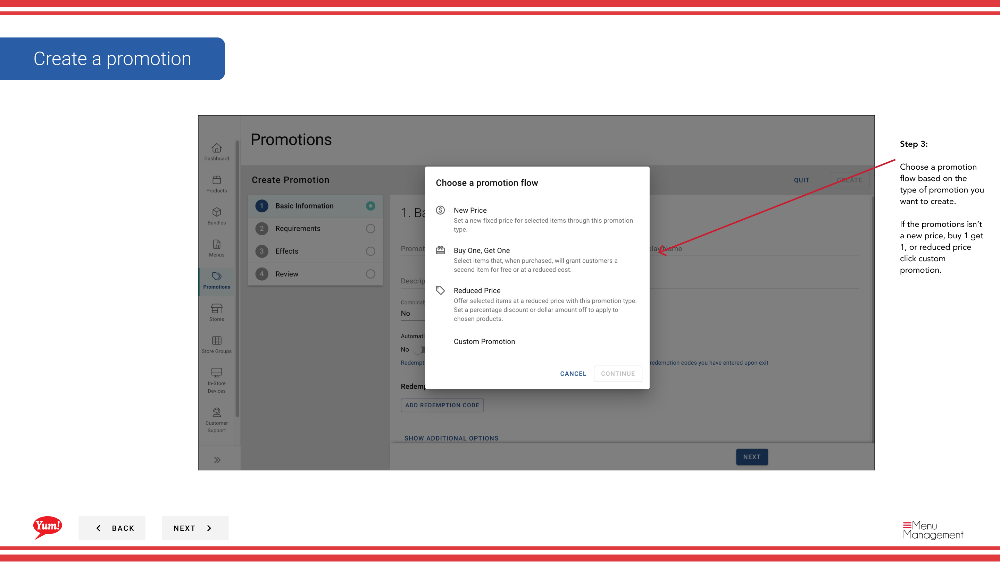
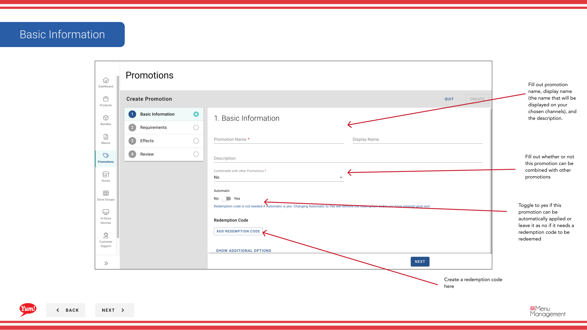

# Create a Promotion

## What this guide covers

Builds a new promotional rule in Atlas — defining the discount type, conditions, validity period, and applicable store groups — so it can be surfaced to customers through digital ordering channels.

## Steps

**Step 1:** Navigate to the **Promotions** section using the left-hand navigation menu.

**Step 2:** Click the **+ Create New Promotion** button.

**Step 3:** Fill in the promotion details. Fields marked with * are required.

| Field | What to enter | Notes |
|-------|--------------|-------|
| **Promotion Name** * | Internal name for this promotion | e.g., "BOGO Zinger May 2024". Visible to operators only. |
| **Display Name** * | Customer-facing name shown on ordering channels | e.g., "Buy 1 Get 1 Free Zinger". Keep it short and compelling. |
| **Description** | Explains the promotion to customers | Shown on the ordering interface. |

**Step 4:** Select a **Promotion Flow** based on the type of promotion you are creating.

| Flow | Use when... |
|------|-------------|
| **New Price** | You want to set a new fixed price for a qualifying item |
| **Buy 1 Get 1** | Customer buys one item and receives another free or discounted |
| **Reduced Price** | You want to apply a percentage or fixed reduction |
| **Custom Promotion** | The promotion doesn’t fit any of the above flows |

**Step 5:** Add **Requirements** — the conditions a customer must meet to trigger the promotion. Based on your selected flow, recommended requirements will appear below the requirement selector. Click **Add** to include a recommended requirement, or select a requirement type from the dropdown and click **Add Requirement** to build a custom condition.

**Step 6:** Add an **Effect** and fill in the effect details. The effect defines what discount or reward the customer receives when the requirements are met.

**Step 7:** Review all entered information and click **Create** to save the promotion.

:::note
Promotions can only be assigned to a **Store Group**, not to an individual store. See [Assign Promotions to Store Groups](/docs/admin-portal-guide/promotions/assign-promotions-to-store-groups/) after creating your promotion.
:::

## Related guides

- [Assign Promotions to Store Groups](/docs/admin-portal-guide/promotions/assign-promotions-to-store-groups/)
- [Copy a Promotion](/docs/admin-portal-guide/promotions/copy-promotion/)

---

*Part of the [Admin Portal Guide](/docs/admin-portal-guide) · Section: Promotions*