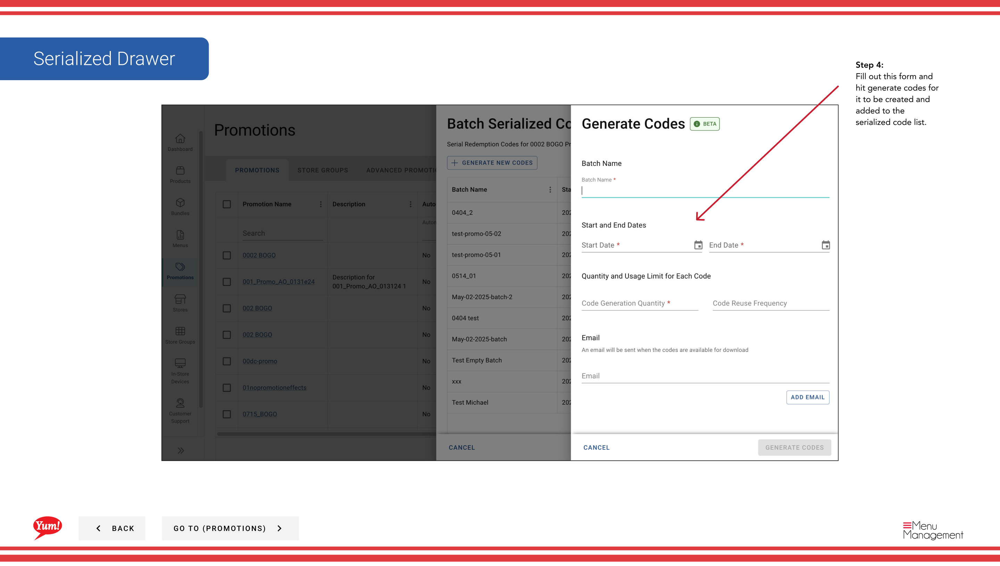

# Create Serialized Code

## What this guide covers

Generates a unique serialised promotional code within a promotion, used for single-use or tracked redemption campaigns.

## Steps

**Step 1:** Start by going to the Promotions screen by clicking here.
**Step 2:** Find the Promotion you’d like to create a serialized code for and click the action button. Then, find and click on “Serialized Code” in the menu.

**Step 3:** Click this button to create a new serialized code for a promotion

**Step 4:** Fill out this form and hit generate codes for it to be created and added to the serialized code list.

## Additional information

- Serialized Code Button
- This is the Promotions screen where you  will see a list of all the promotions you have created, create new promotions, search for any you have created, edit and copy, add extra info in the Meta link and  assign them to Store Groups.  Promotions can only assigned to a Store Group and not a singular store.
- Promotions - Create Serialized Code

---

*Part of the [Admin Portal Guide](/docs/admin-portal-guide) · Section: Promotions*