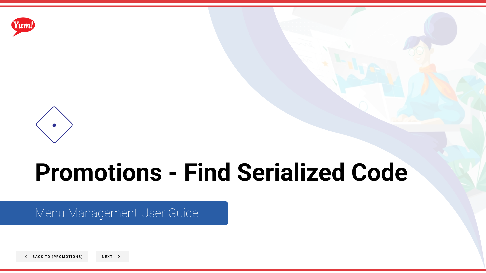

# Find Serialized Code

## What this guide covers

Locates a specific serialised promotional code within Atlas, used when verifying or troubleshooting individual code redemption.

## Steps

**Step 1:** Start by going to the Promotions screen by clicking here.

**Step 2:** Click this button to find a serialized code.

**Step 3:** Enter the serialized code you’d like to find details for in this field then click the “Search” button.

## Additional information

- Promotions - Find Serialized Code
- This is the Promotions screen where you  will see a list of all the promotions you have created, create new promotions, search for any you have created, edit and copy, add extra info in the Meta link and  assign them to Store Groups.  Promotions can only assigned to a Store Group and not a singular store.
- You can void the code you searched for by clicking this button.

---

*Part of the [Admin Portal Guide](/docs/admin-portal-guide) · Section: Promotions*