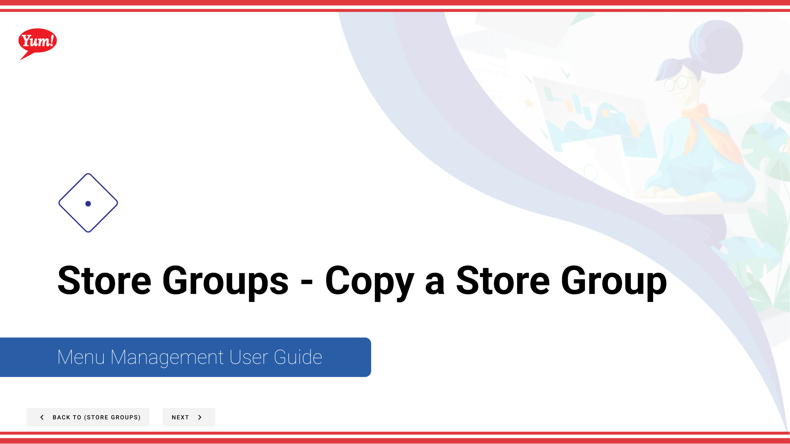

# Copy a Store Group

## What this guide covers

Duplicates a store group configuration as a starting point for a new group.

## Steps

**Step 1:** Start by going to the Store Groups screen by clicking here.

**Step 2:** Once you find the store group you are looking for, click on the stacked dots to open the option window.

**Step 3:** Click on copy

**Step 4:** Type in the store group name for the store you want to create and enter any store group tags if needed.

Since you copied a store group the tags you applied to the group earlier show up

**Step 5:** Toggle this switch to select a store

**Step 6:** Press this create button when finished with each step to finally create your store group.

## Notes

:::note
You can filter by stores and by store groups
:::

:::note
Since you copied a store group the stores that you had included previously in the store group are automatically selected. You can view them by selecting show me included.
:::

:::note
This table allows you to filter by store number, store name, and franchise code to find specific stores.
:::

:::note
This is a review of all the stores that were added
:::

:::note
This is a review of all the actions you’ve done in each step: Store group name/tag, and store selection.
:::

## Additional information

- Menu Management User Guide
- Store Groups - Copy a Store Group
- You can search by store group name and store group tags and see whether or not a store group has a tax association
- You can select these tiles to navigate forward in this flow or click the next button to go to the next step

---

*Part of the [Admin Portal Guide](/docs/admin-portal-guide) · Section: Store Groups*